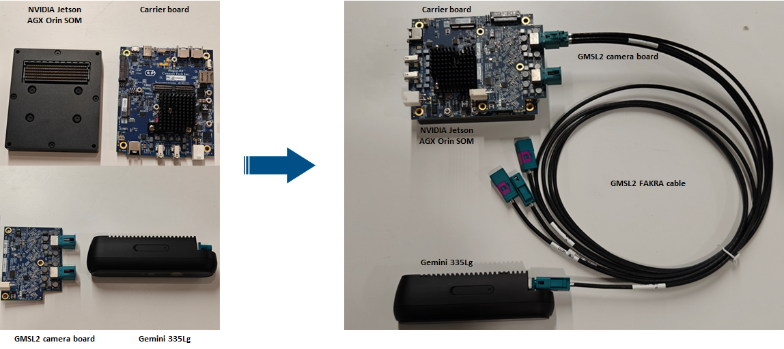

# ORBBEC Camera Driver for GMSL Interface

## Introduction to GMSL Camera Driver
This repository contains driver files for Orbbec GMSL interface cameras, designed to facilitate integration of GMSL interface cameras for developers and customers.

### Directory Structure
- **bin**: Pre-built binary files for Orbbec GMSL cameras; ready for direct integration.
- **doc**: Documentation related to GMSL integration, primarily in MD or PDF format.
- **src**: 
  - **kernel**: Source code for driver adaptation.
  - **patch**: Platform-specific patch files.
- **tools**: Example programs for validating GMSL functionality.

### Branch Description
- **main**: Stable release branch containing tested code and binary files.
- **gemini-335Lg**: Development branch for Gemini 335Lg camera adaptation.
- **gemini-345lg**: Development branch for Gemini 345Lg camera adaptation.

### GMSL Integration Workflow

## Supported Camera Models and Platforms

| Camera Model | Hardware Platform      | Manufacturer | Software Version    | GMSL Adapter Board |
| ------------ | ---------------------- | ------------ | ------------------- | ------------------ |
| Gemini 335Lg | Jetson AGX Orin DevKit | NVIDIA       | Jetpack 6.0/6.1/6.2 | FG96-8CH-V2        |

## GMSL Integration Procedures

 
#### System Block Diagram
- **Hardware Connection Diagram**

The diagram above illustrates a complete hardware connection setup for GMSL cameras. When adapting to different hardware platforms, design differences mainly exist between the Carrier Board and the GMSL Camera Board, requiring both software and hardware adaptation. For detailed hardware and software design specifications, please refer to the steps below.

- **Software Data Flow Diagram**

### Hardware Integration Requirements

Orbbec has adapted various deserializer chips such as MAX9296/96712. For detailed hardware design specifications and instructions, please refer to [Hardware Design Guide](./doc/GMSL%20Camera%20Board%20Hardware%20Design%20Guide.pdf).

### Software Driver Installation
Orbbec has adapted the Gemini 335Lg and Gemini 345Lg cameras for different platforms and deserializer chips. For each platform, pre-compiled binaries, source code patches, and kernel source code are provided to facilitate integration for various customers. Developers and customers should select the appropriate driver installation method based on their carrier board, software version, and deserializer chip model.

- **Pre-compiled Driver Installation**
  - For detailed installation steps, refer to the [ReadMe](/bin/readme.md) in the `bin` directory.

- **Patch Driver Installation**
  - For detailed installation steps, refer to the [ReadMe](/src/patch/readme.md) in the `patch` directory.

- **Kernel Source Installation**
  - Under development, coming soon.

## GMSL Camera Performance Metrics
After successful GMSL camera integration, the following performance metrics should be monitored:
- Timestamp stability
- Frame rate stability
- Synchronization accuracy
For testing methodology and tools, please refer to [Performance Test Guide](./tools/readme.md)

## Usage Limitations of GMSL Cameras
GMSL cameras interface with various deserializer chips such as MAX9296 and MAX92716. Orbbec GMSL cameras support multiple streams including depth, color, IR, and IMU data, but certain usage limitations apply:
- GMSL only supports V4L2 and YUYV format; MJPG format is not supported. RGB output is derived from YUYV format conversion.
- Metadata for Gemini-335Lg is provided via a separate node, while metadata for other models is embedded within video frames, which remains transparent to users.
- Two cameras connected on the same MAX9296, MAX96712 LinkA/B, or MAX96712 LinkC/D have the following limitations:
  - RGB stream from one camera cannot coexist with the right IR stream from another camera.
  - Depth stream from one camera cannot coexist with the left IR stream from another camera.
  - The combined maximum number of active streams from both cameras is limited to four (satisfying the above two conditions ensures compliance).

For further known limitations, please refer to [Usage Limitations of Orbbec GMSL Cameras](./doc/Instructions%20for%20Using%20GMSL%20Camera.md)

## Issue Reporting for GMSL Usage
To streamline issue resolution for developers and customers during GMSL camera integration, we adopt GitHub Issues for tracking feedback due to variations in hardware and software environments. Please follow the guidelines below for issue reporting:

- First check existing issues before submitting a new one.
- If no solution is found, submit a new issue using the provided template to expedite problem diagnosis.

