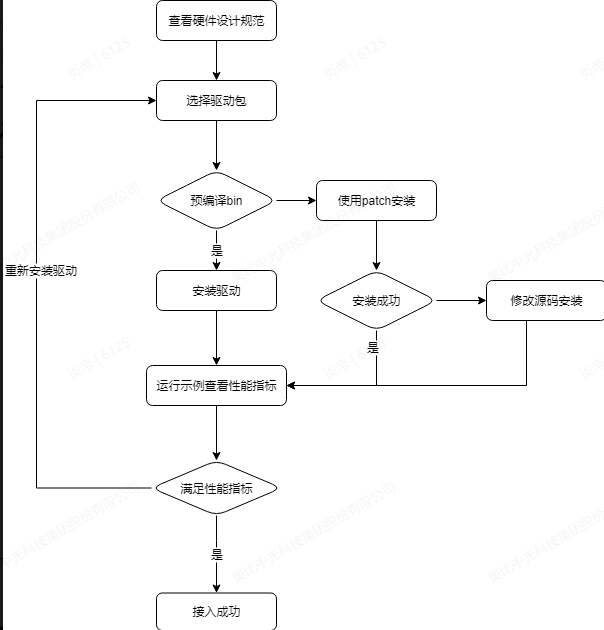
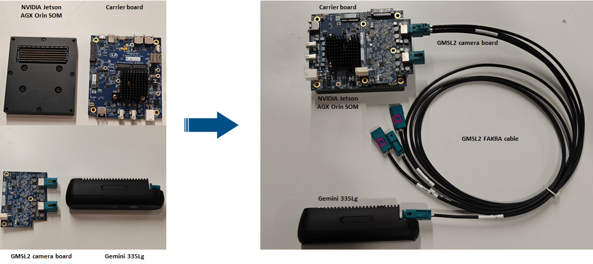
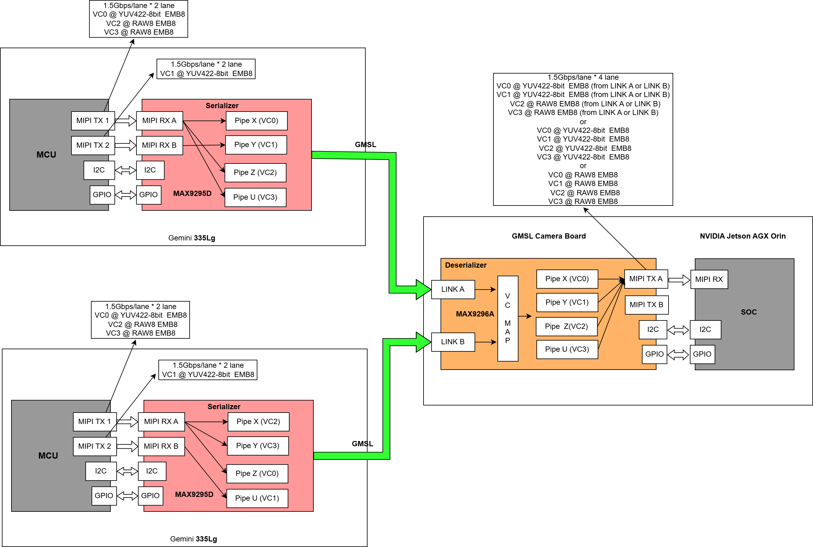

# ORBBEC camera driver for GMSL interface

## GSML相机驱动简介
 本仓库主要存放奥比GMSL接口相机的驱动文件，方便开发者/客户更加方便接入GMSL接口的相机；
 ### 库目录介绍
- bin：放置奥比GMSL相机适配好的二进制文件，直接集成就可以使用；
- doc：放置GMSL接入过程中的文档，以MD和PDF格式为主；
- src：kernel目录放置驱动的适配源码；patch目录放置针对patch文件；
- tools：放置验证GMSL正常运行的demo示例
  
### 代码分支说明
  - main：作为正式版本释放的稳定分支，本分支上的代码、二进制文件都是测试通过的版本；
  - gemini-335Lg：适配Gemini 335Lg的开发分支
  - gemini-345lg：适配Gemini 345Lg的开发分支
  
### GMSL接入流程

  接入过程中优先查看bin目录中是否有针对平台适配的二进制文件，如果有则直接使用；如果没有优先使用patch做代码修改；使用patch需要保证代码一致性；如果使用patch失败或硬件接口有差异，需要根据kernel的源码自行修改，这部分需要较高的技术能力；

  ## 支持相机和平台
| 相机型号     | 硬件平台               | 厂商   | 软件版本            | GMSL 相机板 |
| ------------ | ---------------------- | ------ | ------------------- | ----------- |
| Gemini 335Lg | Jetson AGX Orin DevKit | NVIDIA | Jetpack 6.0/6.1/6.2 | FG96-8CH-V2 |

## GMSL接入操作步骤
  ### 系统框图
  - 硬件连接框图
  
    上述描述一个完整的GMSL相机硬件连接框图，在适配不同硬件平台时，主要Carrier Board和GMSL Camera Board存在设计差异，需要软件和硬件的适配；详细硬件、软件设计规范参考如下步骤；
  - 软件数据流框图
  

  ### 硬件接入要求

  奥比已经适配MX9296/96712等不同的解串芯片；详细硬件设计规范说明，请参考[硬件设计规范](./doc/解串板硬件设计指南.pdf)
  
  ### 软件驱动安装
   奥比将Gemini 335Lg、Gemini 345Lg相机在不同的平台和解串芯片，进行了适配；针对不同的平台，提供预编译文件，源码patch和kernel源码的形式，方便不同的客户进行集成适配；
    开发者/客户需要根据自己的主板、软件版本和解串芯片型号选择，适合自己的驱动安装方式；

   - 预编译驱动安装
     - 详细安装步骤参考bin目录下的[ReadMe](/bin/readme.md)

  - patch驱动安装
    - 详细安装步骤参考patch目录下的[ReadMe](/src/patch/readme.md)
  - kernel源码安装
    - 开发中，即将发布
  
## GMSL相机性能指标
   gmsl相机接入成功后，需要关注GMSL相机如下指标数据；
   - 时间戳稳定性
   - 帧率稳定性
   - 同步精度
  关于性能指标的测试方法和工具，请参考[性能测试说明](./tools/readme.md)

## GMSL使用限制说明
  GMSL相机要接入不同的9296/92716等不同的解串芯片；奥比GMSL相机同时支持深度、彩色、IR、IMU等多路流，在使用方面有一些限制；
   - GMSL 只支持V4L2，YUYV格式，不支持MJPG格式，然后RGB是YUYV格式转换得到。
   - G335Lg metadata 是单独的节点，而系列 metadada 是在视频帧里面，这个对客户是透明的
   - 接在同一Max9296、Max96712 LinkA/B 、Max96712 LinkC/D 上的两个相机使用有以下限制
     -  一个相机的RGB 跟另一个相机的右IR 不能同时开流
     -  一个相机的DEPTH 跟另一个相机的左IR 不能同时开
     -  两个相机加起来最多开4路流（同时满足前两个条件即满足这个条件）
    
  针对更多已知的限制条件，参考[GMSL相机使用限制说明](./doc/Orbbec%20GMSL相机限制说明.md)
## 使用问题反馈

  为了方便众多开发者/客户快速接入GMSL相机，由于各自硬件、软件的差异，可能会遇到各种问题；这些问题可能存在共性，因此采用Github的issue来跟进反馈的问题，针对开发者，规定如下问题反馈流程；
  
- 遇到问题优先在issue中寻找解决方案
- 如果没有检索到，需要新建issue来提交问题
- 提交问题时需要使用issue的模版提交问题描述，可以方便问题快速定位；
  

