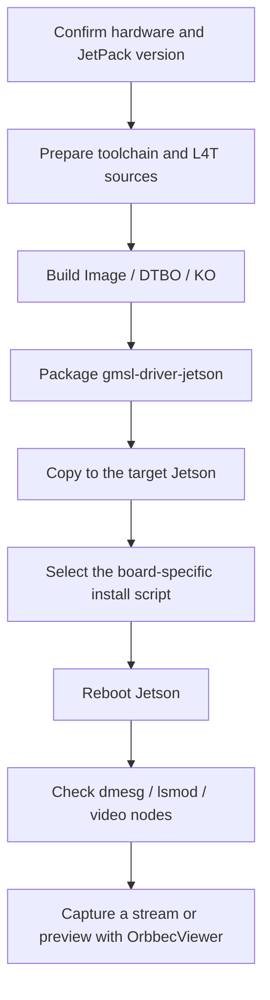
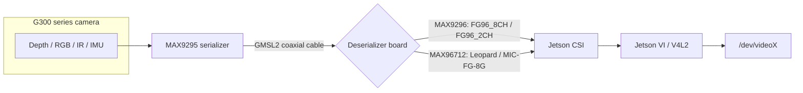
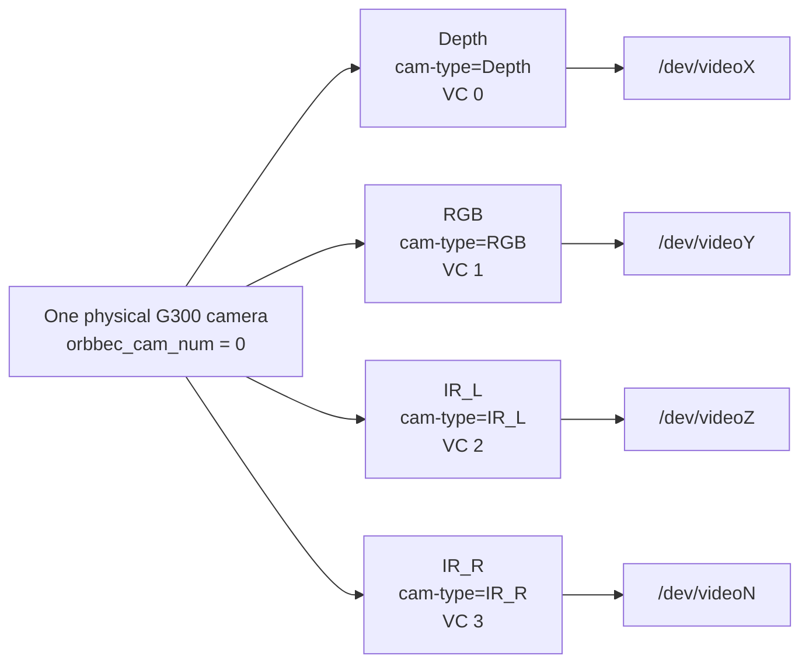
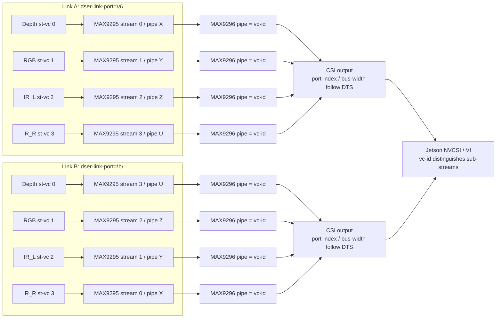
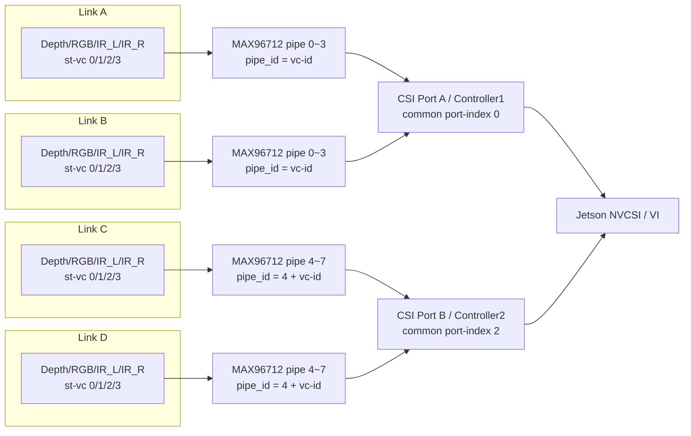
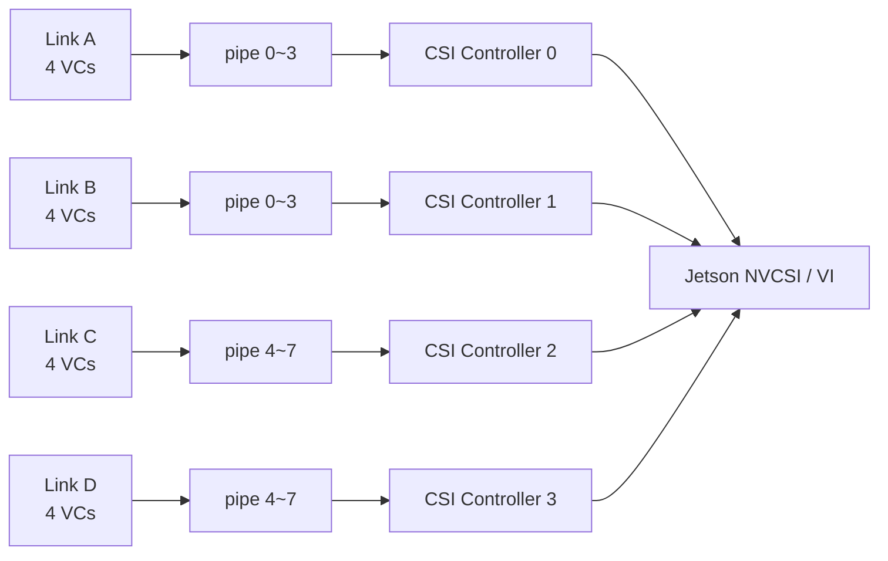
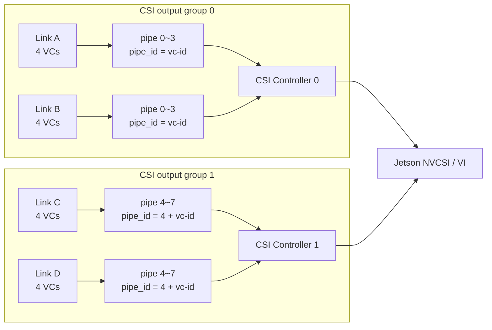

# Orbbec G300 Series GMSL Camera Driver Quick Start Guide

Supported cameras:

- Gemini 335Lg
- Gemini 345Lg
- Gemini 305g
- Gemini 301g
- Dabai AL

Typical supported hardware combinations:

- Jetson AGX Orin + FG96_8CH_GMSL
- Jetson AGX Orin + Leopard LI-JAG-ADP-GMSL2-8CH
- Jetson AGX Orin + MIC-FG-8G
- Jetson AGX Orin + FG12-16CH (JetPack 7.2)
- Jetson Orin NX + FG96_2CH
- Jetson Thor (D317) + D317 GM (JetPack 7.2)
- Jetson Thor (MIC-742 / MIC-743) + MIC-FG-8G (JetPack 7.2)

Deserializer mapping:

| Deserializer board | Deserializer driver | Notes |
| --- | --- | --- |
| FG96_8CH_GMSL | `obc_max9296.ko` | Common 8-channel board for AGX Orin |
| FG96_2CH | `obc_max9296.ko` | Common 2-channel board for Orin NX |
| Leopard LI-JAG-ADP-GMSL2-8CH | `obc_max96712.ko` | Leopard 8-channel board |
| MIC-FG-8G | `obc_max96712.ko` | Advantech MIC-FG-8G board |
| FG12-16CH | `obc_max96712.ko` | 16-channel multi-deserializer board for AGX Orin (JetPack 7.2) |
| D317 GM | `obc_max96712.ko` | Thor (D317) deserializer board (JetPack 7.2) |

Driver modules:

- `g300.ko`: G300 camera driver
- `obc_max9296.ko`: MAX9296 deserializer driver
- `obc_max96712.ko`: MAX96712 deserializer driver
- `obc_cam_sync.ko`: camera synchronization driver
- `obcam.ko`: thin V4L2 subdevice driver used by the obcam-thin path, where userspace owns SerDes/G300 stream configuration

Reading roadmap:



Typical hardware link:



## 0. Understand the Two Machines

The following steps refer to two machines:

- Build host: usually an x86 Ubuntu PC used to download sources and build the kernel and drivers.
- Target Jetson: the Jetson device that is connected to the GMSL adapter board and G300 camera.

You can build directly on Jetson if its performance is sufficient, but cross-compiling on an x86 Ubuntu PC is recommended.

## 1. Prepare Hardware

1. Prepare a Jetson device.

   AGX Orin and Orin NX are supported.

2. Prepare a GMSL deserializer board.

   Select one according to your hardware:

   - FG96_8CH_GMSL: common 8-channel AGX Orin board using MAX9296.
   - FG96_2CH: common 2-channel Orin NX board using MAX9296.
   - LI-JAG-ADP-GMSL2-8CH: Leopard 8-channel board using MAX96712.
   - MIC-FG-8G: Advantech MIC-FG-8G board using MAX96712.

3. Prepare an Orbbec G300 series GMSL camera.

4. Connect the hardware.

   - Power off first.
   - Connect the deserializer board to Jetson.
   - Connect the GMSL coaxial cable to the deserializer board and camera.
   - Make sure the camera power, GMSL cable, and board connectors are secure.
   - Power on Jetson.

## 2. Confirm the Jetson System Version

Run on the target Jetson:

```bash
cat /etc/nv_tegra_release
uname -r
```

Common mappings:

- JetPack 7.2: kernel `6.8.12-1021-tegra`
- JetPack 6.2: kernel `5.15.148-tegra`
- JetPack 6.0: kernel `5.15.136-tegra`

This guide uses JetPack 6.2 as the default example. See the next section for JetPack 6.0, 6.2, and 7.2 differences.

### 2.1 JetPack 6.0, 6.2, and 7.2 Differences

The overall flow is the same: prepare sources and toolchain, build, package, copy to Jetson, run the target install script, reboot, and verify. The version numbers, source URLs, toolchain, module directories, and packaging paths are different. JetPack 7.2 also introduces a new kernel series, a new toolchain layout, the Thor platform, and an OOT-only install (it does not replace the kernel `Image`).

| Item | JetPack 7.2 | JetPack 6.2 | JetPack 6.0 |
| --- | --- | --- | --- |
| `build_all.sh` argument | `./build_all.sh 7.2 Linux_for_Tegra/source` | `./build_all.sh 6.2 Linux_for_Tegra/source` | `./build_all.sh 6.0 Linux_for_Tegra/source` |
| L4T tag | `jetson_39.2` | `jetson_36.4.3` | `jetson_36.3` |
| Kernel module directory | `6.8.12-1021-tegra` | `5.15.148-tegra` | `5.15.136-tegra` |
| Kernel source dir | `kernel/kernel-noble` | `kernel/kernel-jammy-src` | `kernel/kernel-jammy-src` |
| Toolchain directory | `l4t-gcc/7.2` (`x-tools/aarch64-none-linux-gnu`) | `l4t-gcc/6.2` (`bin/aarch64-buildroot-linux-gnu`) | `l4t-gcc/6.0` (`bin/aarch64-buildroot-linux-gnu`) |
| Source package URL | `r39_release_v2.0/sources/public_sources.tbz2` | `r36_release_v4.3/sources/public_sources.tbz2` | `r36_release_v3.0/sources/public_sources.tbz2` |
| Extra build deps | adds `libssl-dev zstd` | `build-essential bc flex bison` | `build-essential bc flex bison` |
| DTBO output path | `source/build/nvidia-public/devicetree/generic-dtbs` | `source/kernel-devicetree/generic-dts/dtbs` | `source/nvidia-oot/device-tree/platform/generic-dts/dtbs` |
| NVCsi module | `nvhost-nvcsi.ko` | `nvhost-nvcsi-t194.ko` | `nvhost-nvcsi-t194.ko` |
| Install approach | OOT modules + DTBO only (no `Image` replacement); kernel version checked | Replaces `Image` + modules + DTBO | Replaces `Image` + modules + DTBO |
| Supported platforms | AGX Orin / Orin NX / Thor (D317 / MIC-742 / MIC-743) | AGX Orin / Orin NX | AGX Orin / Orin NX |
| Recommended packaging | `./copy_to_jetson_ssh.sh 7.2` | Use the JP6.2 `copy_to_jetson_ssh.sh`, or package manually as described in section 7 | Use the JP6.0 `copy_to_jetson_ssh.sh`, or package manually |

For JetPack 6.0, replace these values in the guide:

```bash
6.2 -> 6.0
5.15.148-tegra -> 5.15.136-tegra
r36_release_v4.3 -> r36_release_v3.0
```

For JetPack 7.2, the flow diverges more (different toolchain, sources, and install scripts). Follow the dedicated "JetPack 7.2" notes in sections 4, 5, 6, 7, and 9.

Before using `copy_to_jetson_ssh.sh`, make sure the paths inside the script match your JetPack version. JP7.2 uses `images/7.2` and `6.8.12-1021-tegra`; JP6.2 should use `images/6.2` and `5.15.148-tegra`; JP6.0 should use `images/6.0` and `5.15.136-tegra`.

## 3. Install Dependencies on the Build Host

Run on the build host:

```bash
sudo apt update
sudo apt install -y build-essential bc flex bison libssl-dev libelf-dev git wget rsync
```

If you need to transfer files with `scp`, also install:

```bash
sudo apt install -y openssh-client
```

## 4. Prepare the Cross-Compile Toolchain

Run from the repository root on the build host. This guide assumes the repository path is:

```bash
cd /home/yanxiao/agx_orin
```

Create the toolchain directory:

```bash
mkdir -p l4t-gcc/6.2
cd l4t-gcc/6.2
```

Download and extract the NVIDIA Bootlin aarch64 toolchain:

```bash
wget https://developer.nvidia.com/downloads/embedded/l4t/r36_release_v3.0/toolchain/aarch64--glibc--stable-2022.08-1.tar.bz2 -O aarch64--glibc--stable-final.tar.bz2
tar xf aarch64--glibc--stable-final.tar.bz2 --strip-components 1
cd ../..
```

Check the toolchain:

```bash
ls l4t-gcc/6.2/bin/aarch64-buildroot-linux-gnu-gcc
```

For JetPack 6.0, use `l4t-gcc/6.0` instead:

```bash
mkdir -p l4t-gcc/6.0
cd l4t-gcc/6.0
wget https://developer.nvidia.com/downloads/embedded/l4t/r36_release_v3.0/toolchain/aarch64--glibc--stable-2022.08-1.tar.bz2 -O aarch64--glibc--stable-final.tar.bz2
tar xf aarch64--glibc--stable-final.tar.bz2 --strip-components 1
cd ../..
ls l4t-gcc/6.0/bin/aarch64-buildroot-linux-gnu-gcc
```

For JetPack 7.2, the toolchain is a different package (`x-tools.tbz2`) and extracts into `x-tools/aarch64-none-linux-gnu` (no `--strip-components`):

```bash
mkdir -p l4t-gcc/7.2
cd l4t-gcc/7.2
wget https://developer.nvidia.com/downloads/embedded/L4T/r38_Release_v2.0/release/x-tools.tbz2
tar xf x-tools.tbz2
cd ../..
ls l4t-gcc/7.2/x-tools/aarch64-none-linux-gnu/bin/aarch64-none-linux-gnu-gcc
```

## 5. Prepare NVIDIA L4T Sources

Run from the repository root on the build host:

```bash
mkdir -p Linux_for_Tegra
cd Linux_for_Tegra
wget https://developer.nvidia.com/downloads/embedded/l4t/r36_release_v4.3/sources/public_sources.tbz2
tar xjf public_sources.tbz2
cd source
tar xjf kernel_src.tbz2
tar xjf kernel_oot_modules_src.tbz2
tar xjf nvidia_kernel_display_driver_source.tbz2
cd ../..
```

If `Linux_for_Tegra/source/kernel/kernel-jammy-src` and `Linux_for_Tegra/source/nvidia-oot` already exist in your repository, you can skip this step.

Check the source directories:

```bash
ls Linux_for_Tegra/source/kernel/kernel-jammy-src
ls Linux_for_Tegra/source/nvidia-oot
```

For JetPack 6.0, use the JP6.0 source package:

```bash
mkdir -p Linux_for_Tegra
cd Linux_for_Tegra
wget https://developer.nvidia.com/downloads/embedded/l4t/r36_release_v3.0/sources/public_sources.tbz2
tar xjf public_sources.tbz2
cd source
tar xjf kernel_src.tbz2
tar xjf kernel_oot_modules_src.tbz2
tar xjf nvidia_kernel_display_driver_source.tbz2
cd ../..
```

For JetPack 7.2, use the `r39` source package and extract one additional tarball (`nvidia_unified_gpu_display_driver_source.tbz2`):

```bash
mkdir -p Linux_for_Tegra
cd Linux_for_Tegra
wget https://developer.nvidia.com/downloads/embedded/L4T/r39_Release_v2.0/sources/public_sources.tbz2
tar xjf public_sources.tbz2
cd source
tar xf kernel_src.tbz2
tar xf kernel_oot_modules_src.tbz2
tar xf nvidia_kernel_display_driver_source.tbz2
tar xf nvidia_unified_gpu_display_driver_source.tbz2
cd ../..
```

## 6. Build the Kernel, DTB, and G300 Driver

Run from the repository root on the build host:

```bash
cd /home/yanxiao/agx_orin
./build_all.sh 6.2 Linux_for_Tegra/source
```

Without arguments, the script also defaults to JetPack 6.2:

```bash
./build_all.sh
```

The build takes some time. A successful build generates:

```bash
images/6.2/rootfs/boot/Image
images/6.2/rootfs/boot/*.dtbo
images/6.2/rootfs/lib/modules/5.15.148-tegra/updates/
```

Check key outputs:

```bash
ls images/6.2/rootfs/boot/Image
ls images/6.2/rootfs/boot/tegra234-p3737-camera-g300-fg96-overlay.dtbo
ls images/6.2/rootfs/boot/tegra234-p3737-camera-g300-nomtd-fg96-overlay.dtbo
ls images/6.2/rootfs/boot/tegra234-p3737-camera-g300-leopard-overlay.dtbo
ls images/6.2/rootfs/boot/tegra234-p3737-camera-g300-nomtd-leopard-overlay.dtbo
ls images/6.2/rootfs/boot/tegra234-p3737-camera-g300-mic-fg-8g-overlay.dtbo
ls images/6.2/rootfs/boot/tegra234-p3767-camera-p3768-g300-fg96-overlay.dtbo
ls images/6.2/rootfs/boot/tegra234-p3767-camera-p3768-g300-nomtd-fg96-overlay.dtbo
ls images/6.2/rootfs/lib/modules/5.15.148-tegra/updates/drivers/media/i2c/g300.ko
ls images/6.2/rootfs/lib/modules/5.15.148-tegra/updates/drivers/media/i2c/obc_max9296.ko
ls images/6.2/rootfs/lib/modules/5.15.148-tegra/updates/drivers/media/i2c/obc_max96712.ko
```

For JetPack 6.0:

```bash
./build_all.sh 6.0 Linux_for_Tegra/source
ls images/6.0/rootfs/boot/Image
ls images/6.0/rootfs/boot/tegra234-p3737-camera-g300-fg96-overlay.dtbo
ls images/6.0/rootfs/boot/tegra234-p3737-camera-g300-nomtd-fg96-overlay.dtbo
ls images/6.0/rootfs/boot/tegra234-p3737-camera-g300-leopard-overlay.dtbo
ls images/6.0/rootfs/boot/tegra234-p3737-camera-g300-nomtd-leopard-overlay.dtbo
ls images/6.0/rootfs/boot/tegra234-p3737-camera-g300-mic-fg-8g-overlay.dtbo
ls images/6.0/rootfs/boot/tegra234-p3767-camera-p3768-g300-fg96-overlay.dtbo
ls images/6.0/rootfs/boot/tegra234-p3767-camera-p3768-g300-nomtd-fg96-overlay.dtbo
ls images/6.0/rootfs/lib/modules/5.15.136-tegra/updates/drivers/media/i2c/g300.ko
ls images/6.0/rootfs/lib/modules/5.15.136-tegra/updates/drivers/media/i2c/obc_max9296.ko
ls images/6.0/rootfs/lib/modules/5.15.136-tegra/updates/drivers/media/i2c/obc_max96712.ko
```

For JetPack 7.2, apply the 7.2 patch, install the extra build dependencies, and build:

```bash
# Apply the JetPack 7.2 G300 patch
git apply jetson_jp7.2_g300_driver_v1.2.21.patch

# install dependencies (7.2 adds libssl-dev and zstd)
sudo apt install build-essential bc flex bison libssl-dev zstd

# build kernel, dtb and G300 driver
./build_all.sh 7.2 Linux_for_Tegra/source
```

Check key outputs (7.2 uses the `6.8.12-1021-tegra` kernel and a different DTBO output path):

```bash
ls images/7.2/rootfs/lib/modules/6.8.12-1021-tegra/updates/drivers/media/i2c/g300.ko
ls images/7.2/rootfs/lib/modules/6.8.12-1021-tegra/updates/drivers/media/i2c/obc_max9296.ko
ls images/7.2/rootfs/lib/modules/6.8.12-1021-tegra/updates/drivers/media/i2c/obc_max96712.ko
ls images/7.2/rootfs/lib/modules/6.8.12-1021-tegra/updates/drivers/media/i2c/obcam.ko
ls Linux_for_Tegra/source/build/nvidia-public/devicetree/generic-dtbs/tegra234-p3737-camera-g300-fg96-overlay.dtbo
ls Linux_for_Tegra/source/build/nvidia-public/devicetree/generic-dtbs/tegra234-p3737-camera-g300-fg12-overlay.dtbo
ls Linux_for_Tegra/source/build/nvidia-public/devicetree/generic-dtbs/tegra264-p4071-camera-g300-d317-gm-overlay.dtbo
```

## 7. Package Files for Jetson

Prefer the `copy_to_jetson_ssh.sh` script that matches your JetPack version.

Before using it, check the version paths:

```bash
grep -n "images/6\\.|5.15.*-tegra" copy_to_jetson_ssh.sh
```

For JetPack 6.2, the script should contain `images/6.2` and `5.15.148-tegra`. For JetPack 6.0, it should contain `images/6.0` and `5.15.136-tegra`.

If the version matches, run:

```bash
sh copy_to_jetson_ssh.sh
```

The script copies the products from `images/<JetPack version>` into `gmsl-driver-jetson`.

For JetPack 7.2, pass the version explicitly. The 7.2 package is OOT-only: it does not include the kernel `Image` or `capture-ivc.ko`, uses `nvhost-nvcsi.ko` (not `nvhost-nvcsi-t194.ko`), and includes `obcam.ko` for the obcam-thin path.

```bash
sh copy_to_jetson_ssh.sh 7.2
```

If the script version does not match your build version, use the script from the matching JetPack directory or package manually as follows.

Manual packaging from the repository root:

```bash
rm -rf gmsl-driver-jetson
mkdir -p gmsl-driver-jetson
cp images/6.2/rootfs/boot/Image gmsl-driver-jetson/
cp images/6.2/rootfs/boot/tegra234-*-g300-*.dtbo gmsl-driver-jetson/
cp images/6.2/rootfs/lib/modules/5.15.148-tegra/updates/drivers/media/platform/tegra/camera/tegra-camera.ko gmsl-driver-jetson/
cp images/6.2/rootfs/lib/modules/5.15.148-tegra/updates/drivers/media/i2c/obc_max9296.ko gmsl-driver-jetson/
cp images/6.2/rootfs/lib/modules/5.15.148-tegra/updates/drivers/media/i2c/obc_max96712.ko gmsl-driver-jetson/
cp images/6.2/rootfs/lib/modules/5.15.148-tegra/updates/drivers/media/i2c/g300.ko gmsl-driver-jetson/
cp images/6.2/rootfs/lib/modules/5.15.148-tegra/updates/drivers/misc/obc_cam_sync.ko gmsl-driver-jetson/
cp images/6.2/rootfs/lib/modules/5.15.148-tegra/updates/drivers/platform/tegra/rtcpu/capture-ivc.ko gmsl-driver-jetson/
cp images/6.2/rootfs/lib/modules/5.15.148-tegra/updates/drivers/video/tegra/host/nvcsi/nvhost-nvcsi-t194.ko gmsl-driver-jetson/
cp images/6.2/rootfs/lib/modules/5.15.148-tegra/kernel/drivers/media/v4l2-core/videodev.ko gmsl-driver-jetson/
cp copy_to_target_agx_orin_fg96.sh gmsl-driver-jetson/
cp copy_to_target_agx_orin_nomtd_fg96.sh gmsl-driver-jetson/
cp copy_to_target_agx_orin_leopard.sh gmsl-driver-jetson/
cp copy_to_target_agx_orin_nomtd_leopard.sh gmsl-driver-jetson/
cp copy_to_target_agx_orin_mic_fg_8g.sh gmsl-driver-jetson/
cp copy_to_target_agx_orin_leopard_obcam.sh gmsl-driver-jetson/
cp copy_to_target_orin_nx_fg96.sh gmsl-driver-jetson/
cp copy_to_target_orin_nx_nomtd_fg96.sh gmsl-driver-jetson/
cp reconnect.sh gmsl-driver-jetson/
ls gmsl-driver-jetson
```

The package should contain at least:

```text
Image
g300.ko
obc_max9296.ko
obc_max96712.ko
obc_cam_sync.ko
tegra-camera.ko
videodev.ko
capture-ivc.ko
nvhost-nvcsi-t194.ko
copy_to_target_*.sh
tegra234-*-g300-*.dtbo
```

## 8. Copy Files to the Target Jetson

Check the IP address on the target Jetson:

```bash
ip addr
```

Assume the Jetson user is `nvidia` and the IP address is `192.168.1.100`.

Run on the build host:

```bash
scp -r gmsl-driver-jetson nvidia@192.168.1.100:~/
```

After transfer, log in to Jetson:

```bash
ssh nvidia@192.168.1.100
```

## 9. Select the Correct Install Script on Jetson

Run on the target Jetson:

```bash
cd ~/gmsl-driver-jetson
ls
```

Select one script according to your hardware.

### 9.1 AGX Orin + FG96_8CH_GMSL (MAX9296)

Regular installation:

```bash
sh copy_to_target_agx_orin_fg96.sh
```

If your camera uses metadata embedded in the first image row:

```bash
sh copy_to_target_agx_orin_nomtd_fg96.sh
```

### 9.2 AGX Orin + Leopard LI-JAG-ADP-GMSL2-8CH (MAX96712)

Regular installation:

```bash
sh copy_to_target_agx_orin_leopard.sh
```

If your camera uses metadata embedded in the first image row:

```bash
sh copy_to_target_agx_orin_nomtd_leopard.sh
```

If you explicitly need the `obcam.ko` solution:

```bash
sh copy_to_target_agx_orin_leopard_obcam.sh
```

### 9.3 AGX Orin + MIC-FG-8G (MAX96712)

```bash
sh copy_to_target_agx_orin_mic_fg_8g.sh
```

### 9.4 Orin NX + FG96_2CH (MAX9296)

Regular installation:

```bash
sh copy_to_target_orin_nx_fg96.sh
```

If your camera uses metadata embedded in the first image row:

```bash
sh copy_to_target_orin_nx_nomtd_fg96.sh
```

### 9.5 JetPack 7.2 additional install scripts

JetPack 7.2 adds the following board combinations. The 7.2 install scripts also verify that the running kernel is `6.8.12-1021-tegra` and refuse to install otherwise, so they cannot be mixed with JP6.0/6.2 packages.

AGX Orin + FG12-16CH (MAX96712, 16-channel multi-deserializer board):

```bash
sh copy_to_target_agx_orin_fg12.sh
```

AGX Orin + FG96 obcam-thin (userspace-controlled SerDes):

```bash
sh copy_to_target_agx_orin_fg96_obcam.sh
```

Thor (D317) + D317 GM (MAX96712):

```bash
sh copy_to_target_thor_dm317.sh
```

Thor (MIC-742 / MIC-743) + MIC-FG-8G (MAX96712):

```bash
sh copy_to_target_thor_mic_fg_8g.sh
```

The install scripts:

- Back up the original `/boot/Image`
- Back up original kernel modules
- Copy the new `Image`
- Copy new `.dtbo` files
- Copy new `.ko` files
- Enable the Orbbec Camera device tree overlay through Jetson IO
- Run `depmod`

On JetPack 7.2 the install scripts are OOT-only: they do **not** back up or replace `/boot/Image`. They back up and replace `tegra-camera.ko`, `videodev.ko`, and `nvhost-nvcsi.ko`, copy the G300/deserializer/`obcam.ko` modules, install the DTBO, and run Jetson IO (`config-by-hardware.py -n 2="Jetson Orbbec Camera G300"` for Orin, `-n 1=...` for Thor, `-n 2="Jetson Orbbec Camera G300 obcam thin"` for obcam-thin). To uninstall, run `./remove_g300.sh` in the `gmsl-driver-jetson` directory; it restores the `.orig` backups and removes the G300 modules.

## 10. Reboot Jetson

Reboot after installation:

```bash
sudo reboot
```

Log in to Jetson again after reboot.

## 11. Check Whether Drivers Are Loaded

Run on the target Jetson:

```bash
lsmod | grep -E "g300|obc_max9296|obc_max96712|obc_cam_sync"
```

Check kernel logs:

```bash
dmesg | grep -i g300
dmesg | grep -i orbbec
dmesg | grep -i max9296   # If using a MAX9296 deserializer
dmesg | grep -i max96712  # If using a MAX96712 deserializer
```

Normally you should see logs similar to:

```text
Orbbec gmsl camera driver version
```

If there are no G300, Orbbec, MAX9296, or MAX96712 logs, check:

- Whether the wrong install script was selected.
- Whether Jetson was actually rebooted.
- Whether the `.dtbo` was enabled by Jetson IO.
- Whether `lsmod | grep -E "g300|obc_max9296|obc_max96712|obc_cam_sync"` shows that the drivers are loaded.

Check board-specific deserializer logs:

- FG96_8CH_GMSL / FG96_2CH: focus on `max9296`.
- Leopard / MIC-FG-8G: focus on `max96712`.

## 12. Check Video Nodes

Install tools on the target Jetson:

```bash
sudo apt update
sudo apt install -y v4l-utils
```

List video devices:

```bash
v4l2-ctl --list-devices
ls /dev/video*
```

List formats supported by one node:

```bash
v4l2-ctl -d /dev/video0 --list-formats-ext
```

If `/dev/video*` does not exist, the driver or device tree is not working correctly. See section 17.

## 13. Capture One Frame for Verification

Select an existing video node, for example `/dev/video0`.

Run on the target Jetson:

```bash
v4l2-ctl -d /dev/video0 --stream-mmap --stream-count=30 --stream-to=test.raw
```

If the command completes and creates `test.raw`, the basic video stream is working.

Check the file size:

```bash
ls -lh test.raw
```

If the file size is 0, no valid image was captured.

## 14. Preview with OrbbecViewer

Download and extract OrbbecViewer.

Download URL: https://github.com/orbbec/OrbbecSDK_v2/releases/

In the Jetson GUI, enter the extracted directory and run:

```bash
./OrbbecViewer
```

If you log in through SSH without a graphical environment, OrbbecViewer may not open a window. In that case, first use the `v4l2-ctl` stream capture command in section 13 to verify basic output.

## 15. Reload the G300 Driver

If you only want to reinitialize the link without rebooting the whole system, run from `~/gmsl-driver-jetson` on the target Jetson:

```bash
sh reconnect.sh
```

The script unloads and reloads:

- `obc_max9296.ko`
- `obc_max96712.ko`
- `g300.ko`

If the camera is being used by an application, unloading modules may fail. Close the camera application first.

## 16. Adapting the Device Tree for Non-Reference Hardware

If you are not using the reference hardware in this guide, such as a custom carrier board, custom GMSL deserializer board, different I2C routing, different CSI interface, different reset GPIO, or only 1, 2, or 4 connected cameras, update the device tree according to the real hardware.

Device tree adaptation tells the driver four things:

- Which I2C bus and I2C address the deserializer uses.
- Which deserializer GMSL link each G300 camera is connected to.
- Which Jetson CSI port the deserializer output connects to, how many lanes are used, and how VC is mapped.
- How reset, synchronization, power, and other control signals are connected.

Important fields read by the G300 driver:

| Field | Node | Purpose |
| --- | --- | --- |
| `compatible` | Deserializer node | Selects `obc_max9296` or `obc_max96712` |
| `reg` | Deserializer/camera node | 7-bit I2C address |
| `nvidia,gmsl-dser-device` | G300 camera node | References the deserializer node, for example `<&dser0>` |
| `dser-link-port` | G300 camera node | Deserializer link `a/b/c/d` |
| `st-vc` | G300 camera node | Source VC output by the camera |
| `vc-id` | G300 camera node and endpoint | Target VC received by Jetson VI/CSI |
| `orbbec_cam_num` | G300 camera node | Physical G300 camera index, usually starting from 0 |
| `cam-type` | G300 camera node | Sub-stream type: `Depth/RGB/IR_L/IR_R` |
| `port-index` | endpoint | Jetson CSI port index |
| `bus-width` | endpoint | MIPI CSI lane count |
| `remote-endpoint` | endpoint | Connects VI, NVCSI, and sensor endpoints |
| `link_mask` | Deserializer node | GMSL links connected to Orbbec cameras |
| `seri-addr` | Deserializer node | Start address for MAX9295 serializer I2C proxy addresses |
| `proxy-addr` | Deserializer node | Start address for camera I2C proxy addresses |
| `real-addr` | Deserializer node | Real G300 camera I2C address, default `0x66` |
| `reset-gpios` | Deserializer node | Deserializer reset GPIO |
| `csi-mode` / `num_lanes` / `mipi_rate` | Deserializer node | Deserializer MIPI output configuration |

### 16.1 Choose the Closest Reference Template

Do not write a DTS from scratch. Copy the closest reference overlay first.

| Your hardware is closer to | Recommended reference |
| --- | --- |
| MAX9296, 2-link deserializer, similar to FG96 | `tegra234-p3737-camera-g300-fg96-overlay.dts` or `tegra234-p3767-camera-p3768-g300-fg96-overlay.dts` |
| MAX96712, 4-link deserializer, similar to Leopard | `tegra234-p3737-camera-g300-leopard-overlay.dts` |
| MAX96712, similar to MIC-FG-8G | `tegra234-p3737-camera-g300-mic-fg-8g-overlay.dts` |
| Metadata embedded in the first image row | Use a `nomtd` overlay as reference |
| MAX96712, 16-channel multi-deserializer, similar to FG12-16CH (JetPack 7.2) | `tegra234-p3737-camera-g300-fg12-overlay.dts` |
| MAX96712, Thor (D317) deserializer board (JetPack 7.2) | `tegra264-p4071-camera-g300-d317-gm-overlay.dts` |
| Thor (MIC-742/743) + MIC-FG-8G (JetPack 7.2) | `tegra264-p4071-camera-g300-mic-fg-8g-overlay.dts` |

Example:

```bash
cd Linux_for_Tegra/source/hardware/nvidia/t23x/nv-public/overlay
cp tegra234-p3737-camera-g300-leopard-overlay.dts tegra234-p3737-camera-g300-custom-overlay.dts
```

If you want `build_all.sh` to copy the new `.dtbo` automatically, add the new overlay to the corresponding Makefile/build rule. Otherwise, manually build and copy the `.dtbo`.

### 16.2 Create a Hardware Connection Table First

Before editing the device tree, write down the hardware connection table. Without it, link, VC, and CSI port mappings are easy to mix up.

| Item | Example | Confirm for your hardware |
| --- | --- | --- |
| Jetson platform | AGX Orin / Orin NX | Module and carrier |
| Deserializer model | MAX9296 / MAX96712 | Determines `compatible` and reference template |
| Deserializer I2C bus | `i2c@3180000` / `i2c@31e0000` | Schematic and `i2cdetect -l` |
| Deserializer I2C address | MAX9296 often `0x48`, MAX96712 often `0x29` | DTS `reg` |
| I2C mux | FG96 uses `tca9546@70` | Whether your board has a mux and which channel is used |
| Deserializer reset GPIO | `CAM0_PWDN` | GPIO number and polarity from schematic |
| Deserializer CSI output | `serial_a/c/e/g` | Which Jetson CSI connector is used |
| MIPI lane count | 2 lanes / 4 lanes | `bus-width` and `num_lanes` |
| GMSL link wiring | Link A/B/C/D | `dser-link-port` and `link_mask` |
| Camera index | 0/1/2/3... | `orbbec_cam_num` |
| Camera real I2C address | Fixed `0x66` | `real-addr` |
| Serializer proxy addresses | MAX9296 default `0x50~0x51`, MAX96712 default `0x48~0x4B` | `seri-addr`, avoid conflicts |
| Camera proxy addresses | MAX9296 default `0x1a~0x1b`, MAX96712 default `0x20~0x23` | `proxy-addr`, avoid conflicts |
| Sync signals | FSYNC/PPS/MFP | `fsync_mfp_index`, `pps_mfp_index`, `pps-gpios` |

Useful Jetson commands:

```bash
i2cdetect -l
sudo i2cdetect -y <bus>
```

If the deserializer address is not detected, check power, reset GPIO, I2C bus number, I2C mux channel, and address before changing VI/CSI.

### 16.3 Modify the Deserializer Node

The deserializer node is the first key point when adapting new hardware.

MAX9296 example:

```dts
dser0: max9296@48 {
    status = "okay";
    reg = <0x48>;
    compatible = "maxim,obc_max9296";
    index = <0>;
    csi-mode = "2x4";
    num_lanes = "4";
    mipi_rate = <15>;
    seri-addr = <0x50>;
    proxy-addr = <0x1a>;
    real-addr = <0x66>;
    reset-gpios = <&gpio CAM0_PWDN GPIO_ACTIVE_HIGH>;
    fsync_mfp_index = <6>;
    pps_mfp_index = <9>;
    link_mask = <0x03>;
    vdd_supply_1v2;
};
```

MAX96712 example:

```dts
dser0: max96712@29 {
    status = "okay";
    reg = <0x29>;
    compatible = "maxim,obc_max96712";
    index = <0>;
    csi-mode = "2x4";
    num_lanes = "4";
    mipi_rate = <15>;
    port_a_clk = "CKC";
    is_port_b_connected;
    seri-addr = <0x48>;
    proxy-addr = <0x20>;
    real-addr = <0x66>;
    reset-gpios = <&gpio CAM0_PWDN GPIO_ACTIVE_HIGH>;
    fsync_mfp_index = <2>;
    pps_mfp_index = <9>;
    link_mask = <0x0F>;
    vdd_supply_1v2;
};
```

Modification rules:

- `compatible`: use `"maxim,obc_max9296"` for MAX9296 and `"maxim,obc_max96712"` for MAX96712.
- `reg`: use the actual 7-bit I2C address. For example, 8-bit address `0x90` corresponds to 7-bit `0x48`.
- `index`: increment when multiple deserializers of the same type exist. Start from 0.
- `reset-gpios`: set the PWDNB GPIO and polarity according to the carrier schematic.
- `link_mask`: set according to the GMSL links that have Orbbec cameras connected.
- `seri-addr`: start address for serializer proxy addresses. The driver increments this value by link.
- `proxy-addr`: start address for camera proxy addresses. Avoid conflicts with serializer proxy addresses and other devices on the same I2C bus.
- `real-addr`: G300 default real address is `0x66` unless firmware or hardware changes it.
- `csi-mode`: must match the deserializer-to-Jetson hardware. `2x4` means two CSI PHY outputs, each up to 4 data lanes; `4x2` means four CSI PHY outputs, each up to 2 data lanes.

  A common misunderstanding is that `2x4` always means that 4 data lanes are physically used. That is not correct. `2x4` describes the PHY output mode: each PHY can support up to 4 lanes, while the actual hardware can use 1, 2, 3, or 4 lanes. Common configurations use 2 lanes or 4 lanes.

  MAX96712 has 4 PHYs. If the hardware connection supports it, either `2x4` or `4x2` can be selected.

  2x4 lane mode:

  

  4x2 lane mode:

  

  MAX96712 CSI connection reference:

  

  MAX9296 has only 2 PHYs and 2 clock lanes, so it can only use `2x4` mode:

  

- `num_lanes`: data lane count per deserializer CSI port. `num_lanes = "4"` means 4 lanes.
- `mipi_rate`: deserializer MIPI output rate. `mipi_rate = <15>` means 1.5 Gbps/lane.
- `port_a_clk`: MAX96712-specific. Configure according to the schematic. For example, if Jetson CSI 0/1 is connected to MAX96712 Port A and the CSI 0 clock lane is connected to MAX96712 CKC, configure `port_a_clk = "CKC"`. If the CSI 0 clock lane is connected to MAX96712 CKA, configure `port_a_clk = "CKA"`. Note that if the CSI 0 clock lane is connected to CKA, `2x4` mode is usually the only available mode. The hardware can support both `2x4` and `4x2` only when the CSI 0 clock lane is connected to CKC and the CSI 1 clock lane is connected to CKA.
- `is_port_b_connected`: MAX96712-specific. Keep it if MAX96712 Port B is connected to Jetson CSI; otherwise comment it out or remove it.

Common `link_mask` values:

| Connected links | `link_mask` |
| --- | --- |
| Link A only | `<0x01>` |
| Link B only | `<0x02>` |
| Link A + B | `<0x03>` |
| Link A + B + C + D | `<0x0F>` |

### 16.4 Modify G300 Camera Nodes

Each physical G300 camera usually has multiple video sub-stream nodes, such as Depth, RGB, IR_L, and IR_R. They share the same `orbbec_cam_num`, but use different `cam-type`, `vc-id`, and `remote-endpoint` values.

Single G300 sub-stream example:



Typical G300 subnode:

```dts
g2m0_0: g2m0@66 {
    status = "okay";
    reg = <0x66>;
    compatible = "orbbec,g300";
    use_sensor_mode_id = "true";
    vcc-supply = <&vdd_1v8_ls>;
    cam-type = "Depth";
    dser-link-port = "a";
    st-vc = <0>;
    vc-id = <0>;
    orbbec_cam_num = <0>;
    nvidia,gmsl-dser-device = <&dser0>;

    ports {
        port@0 {
            reg = <0>;
            g2m0_0_out: endpoint {
                vc-id = <0>;
                port-index = <0>;
                bus-width = <4>;
                remote-endpoint = <&g300_csi_in0>;
            };
        };
    };

    mode0 {
        embedded_metadata_height = "1";
    };
};
```

Modification rules:

- `reg`: 7-bit address used by the camera node in the current device tree/I2C view.
- `cam-type`: use `Depth`, `RGB`, `IR_L`, or `IR_R`.
- `dser-link-port`: physical GMSL link. Use `"a"`, `"b"`, `"c"`, or `"d"`.
- `st-vc`: source VC from the camera. Depth/RGB/IR_L/IR_R are fixed to 0/1/2/3.
- `vc-id`: target VC after deserializer mapping. Keep it consistent with endpoints and VI.
- `orbbec_cam_num`: all sub-streams of one physical G300 must use the same number; different physical cameras should increment it.
- `nvidia,gmsl-dser-device`: reference the real deserializer node, such as `<&dser0>` or `<&dser1>`.
- `port-index`: Jetson CSI port. Update according to the actual MIPI connection.
- `bus-width`: CSI lane count. It must match the hardware lane count.
- `remote-endpoint`: must point to the paired CSI endpoint, and the CSI endpoint must point back.
- `embedded_metadata_height`: `"1"` means metadata is transmitted through a separate EMB8 channel; `"0"` means metadata is embedded in the first image row.

### 16.5 Link / Pipe / CSI Data Flow

Each physical G300 camera can have up to four video sub-streams. The driver uses `cam-type` to select the internal camera stream, `st-vc` as the camera-side source VC, and `vc-id` as the target VC output by the deserializer to Jetson.

Default stream meanings:

| Sub-stream | `cam-type` | Camera source VC, `st-vc` | Serializer stream / pipe | Common target VC, `vc-id` |
| --- | --- | --- | --- | --- |
| Depth | `"Depth"` | `<0>` | stream 0 / pipe X | `<0>` or the Depth VC in the reference DTS |
| RGB | `"RGB"` | `<1>` | stream 1 / pipe Y | `<1>` or the RGB VC in the reference DTS |
| IR_L | `"IR_L"` | `<2>` | stream 2 / pipe Z | `<2>` or the IR_L VC in the reference DTS |
| IR_R | `"IR_R"` | `<3>` | stream 3 / pipe U | `<3>` or the IR_R VC in the reference DTS |

Pipe selection rules:

| Deserializer | Links | Deserializer pipe selection | CSI output selection |
| --- | --- | --- | --- |
| MAX9296 | Link A/B | `pipe_id = vc-id`, valid pipes 0-3 | Determined by `csi-mode`/`num_lanes` and endpoint `port-index` |
| MAX96712 | Link A/B/C/D | Link A/B use `pipe_id = vc-id`; Link C/D use `pipe_id = 4 + vc-id`; in 2x4 with one CSI port, 4-7 may fold back to 0-3 | In 2x4 with `is_port_b_connected`, Link A/B map to Port A and Link C/D map to Port B; in 4x2, links usually map to four CSI controllers |

`st-vc` is the source VC before the serializer/deserializer. `vc-id` is the target VC received by Jetson. The `vc-id` in sensor endpoints, NVCSI endpoints, and VI endpoints must be consistent, otherwise `/dev/video*` may exist but streaming can fail.

MAX9296 reference data flow, suitable for 2-link deserializers such as FG96/2CH:



In common MAX9296 reference overlays, the four sub-streams of the same link enter the same `port-index`, and `vc-id` distinguishes Depth/RGB/IR_L/IR_R. Different MAX9296 chips or different physical outputs are assigned to different `port-index` values. If only Link A is enabled, keeping Depth/RGB/IR_L/IR_R as `vc-id = 0/1/2/3` is usually the most intuitive configuration. For Link B, Depth/RGB/IR_L/IR_R are usually kept as `vc-id = 3/2/1/0`, so Link A and Link B can start Depth and RGB at the same time. If Link A and Link B share the same CSI output and one deserializer, two cameras cannot enable all four streams at the same time because a single Jetson CSI path has only VC0-VC3 and the deserializer pipe count is also insufficient.

MAX96712 reference data flow, suitable for 4-link deserializers such as Leopard/MIC-FG-8G:



When MAX96712 uses `csi-mode = "2x4"` and keeps `is_port_b_connected`, the driver maps Link A/B pipes to one CSI output and Link C/D pipes to another CSI output. A common Leopard overlay combination is Link A/B using `port-index = <0>` and Link C/D using `port-index = <2>`. If the board has a second MAX96712, later CSI ports such as `<4>` and `<6>` are used.

If MAX96712 uses `csi-mode = "4x2"` and keeps `is_port_b_connected`, the data flow can be understood as each link being closer to an independent CSI controller:



If MAX96712 uses `csi-mode = "4x2"` but `is_port_b_connected` is commented out or removed, the driver outputs through two CSI controller groups: Link A/B map to Controller0, and Link C/D map to Controller1. In this case, two links in the same group must be distinguished through `vc-id` and endpoint topology. Do not simply treat the four links as four independent CSI outputs.



The `vc-id` values of different links in the reference DTS are not necessarily written as 0/1/2/3 in Depth/RGB/IR_L/IR_R order. The reference templates reverse the target VC order of Link B or Link D so cameras on four links can start Depth and RGB at the same time. When adapting new hardware, do not check only `cam-type`; check `vc-id`, `port-index`, and `bus-width` together in the sensor endpoint, NVCSI input endpoint, and VI endpoint of the same sub-stream.

### 16.6 Modify VI/CSI Topology

The G300 video path has three device tree segments:

```text
G300 sensor endpoint -> NVCSI input endpoint -> NVCSI output endpoint -> VI endpoint
```

They are connected through `remote-endpoint`. For new hardware, make sure:

- The sensor endpoint points to the correct `g300_csi_inX`.
- `g300_csi_inX` points back to the sensor endpoint.
- `g300_csi_outX` points to `g300_vi_inX`.
- `g300_vi_inX` points back to `g300_csi_outX`.
- `vc-id`, `port-index`, and `bus-width` on the same link do not conflict.

If your hardware connects only one or two cameras, you can delete unused G300 sensor nodes, CSI/VI endpoints, and `tegra-camera-platform` module entries. Beginners should disable unused sensor nodes first and simplify later after the first successful stream.

Common reference mapping:

| `tegra_sinterface` | Common `port-index` |
| --- | --- |
| `serial_a` | `<0>` |
| `serial_c` | `<2>` |
| `serial_e` | `<4>` |
| `serial_g` | `<6>` |

This mapping is for reference boards only. For custom carriers, use the schematic and NVIDIA platform DTS as the source of truth.

### 16.7 Modify `tegra-camera-platform`

`tegra-camera-platform` tells the NVIDIA camera framework which camera modules exist and where their sysfs paths are. If you change the I2C bus, mux, or camera address, update `sysfs-device-tree`.

FG96-style path:

```dts
sysfs-device-tree = "/sys/firmware/devicetree/base/bus@0/i2c@3180000/tca9546@70/i2c@0/g2m0@66";
```

Leopard/MIC-style path:

```dts
sysfs-device-tree = "/sys/firmware/devicetree/base/bus@0/i2c@31e0000/g2m0@66";
```

Rules:

- If there is an I2C mux, include the mux node and channel, such as `tca9546@70/i2c@0`.
- If there is no I2C mux, point directly to `i2c@.../g2m...@xx`.
- `@xx` must match the `reg` value of the G300 sensor node.
- `badge`, `position`, and `orientation` can be adjusted according to camera placement, but they do not affect basic probe.

### 16.8 Modify Sync and Reset Signals

Common reference fields:

```dts
#define CAM0_PWDN TEGRA234_MAIN_GPIO(H, 6)

reset-gpios = <&gpio CAM0_PWDN GPIO_ACTIVE_HIGH>;
fsync_mfp_index = <2>;
pps_mfp_index = <9>;
```

For new hardware:

- Change `CAMx_PWDN` to the actual deserializer PWDNB GPIO.
- If reset polarity is reversed, change `GPIO_ACTIVE_HIGH` / `GPIO_ACTIVE_LOW`.
- Update `fsync_mfp_index` and `pps_mfp_index` according to deserializer MFP wiring.
- If sync signals are not connected, basic image output can still work. Keep the reference configuration first, verify basic output, and then tune sync.

### 16.9 Build and Replace the New DTBO

Rebuild after modifying DTS:

```bash
./build_all.sh 6.2 Linux_for_Tegra/source
```

Common JP6.2 output path:

```bash
Linux_for_Tegra/source/kernel-devicetree/generic-dts/dtbs/*.dtbo
```

Common JP6.0 output path:

```bash
Linux_for_Tegra/source/nvidia-oot/device-tree/platform/generic-dts/dtbs/*.dtbo
```

Common JP7.2 output path:

```bash
Linux_for_Tegra/source/build/nvidia-public/devicetree/generic-dtbs/*.dtbo
```

After copying the new `.dtbo` to `gmsl-driver-jetson`, update the target install script to copy your new filename. Example:

```bash
sudo cp tegra234-p3737-camera-g300-custom-overlay.dtbo /boot/tegra234-p3737-camera-g300-overlay.dtbo
sudo /opt/nvidia/jetson-io/config-by-hardware.py -n 2="Jetson Orbbec Camera G335Lg"
sudo depmod
sudo reboot
```

If you change `overlay-name`, also update the name passed to `config-by-hardware.py -n`.

### 16.10 Verification Order for New Hardware

Do not start with `/dev/video*`. Verify in this order:

1. Check whether the deserializer I2C address can be detected.

   ```bash
   i2cdetect -l
   sudo i2cdetect -y <bus>
   ```

2. Check whether the overlay is enabled.

   ```bash
   ls /boot | grep g300
   grep -n "FDTOVERLAYS" /boot/extlinux/extlinux.conf
   ```

3. Check deserializer driver probe logs.

   ```bash
   dmesg | grep -i max9296
   dmesg | grep -i max96712
   ```

4. Check G300 device tree parsing.

   ```bash
   dmesg | grep -i "g300 devicetree parse"
   dmesg | grep -i "orbbec gmsl"
   ```

5. Check video nodes.

   ```bash
   v4l2-ctl --list-devices
   ls /dev/video*
   ```

6. Verify streaming.

   ```bash
   v4l2-ctl -d /dev/video0 --stream-mmap
   ```

### 16.11 Common Adaptation Errors

| Symptom | Check first |
| --- | --- |
| `missing deserializer i2c client` | The `dserX` referenced by `nvidia,gmsl-dser-device` does not exist or the deserializer node did not probe |
| `missing deserializer driver` | Wrong `compatible`, or the corresponding `.ko` is not installed/loaded |
| `No serdes-csi-link found` | G300 node misses `dser-link-port` |
| `No vc-id info` / `No st-vc info` | G300 node misses VC configuration |
| `orbbec_cam_num not found` | G300 node misses `orbbec_cam_num` |
| Deserializer probes, but camera has no image | `link_mask`, `dser-link-port`, cable link order, proxy address |
| `/dev/video*` exists, but streaming fails | `port-index`, `bus-width`, `vc-id`, `remote-endpoint` |
| Only some cameras output images | Link-specific `link_mask`, GMSL cable, camera power, VC mapping |
| Jetson IO cannot find overlay | `overlay-name` does not match the install script's `config-by-hardware.py -n` name |

The safest adaptation strategy is to enable only one camera, one deserializer, and one CSI output first. After image output works, expand to multiple links, cameras, and deserializers.

## 17. Troubleshooting

### 17.1 Cross-Compiler Not Found During Build

Symptom:

```text
aarch64-buildroot-linux-gnu-gcc: No such file or directory
```

Fix:

```bash
ls l4t-gcc/6.2/bin/aarch64-buildroot-linux-gnu-gcc
```

If it does not exist, download the toolchain again as described in section 4.

On JetPack 7.2 the compiler prefix is different. Check and download the `x-tools` toolchain instead:

```bash
ls l4t-gcc/7.2/x-tools/aarch64-none-linux-gnu/bin/aarch64-none-linux-gnu-gcc
```

### 17.2 Install Script Cannot Find `.ko`

Symptom:

```text
cp: cannot stat 'g300.ko': No such file or directory
```

Fix:

Make sure you are in the correct Jetson directory:

```bash
cd ~/gmsl-driver-jetson
ls g300.ko obc_max9296.ko obc_max96712.ko
```

If the files do not exist, package and transfer again as described in section 7.

### 17.3 Install Script Reports `.dtb cannot stat`

Symptom:

```text
cp: cannot stat 'tegra234-xxxx.dtb': No such file or directory
```

Fix:

If only `.dtb` is missing but `Image`, `.dtbo`, `g300.ko`, and the corresponding deserializer `.ko` files have been copied, installation can usually continue. Reboot and verify.

If there are no video nodes after reboot, check whether the base DTB also needs to be synchronized from the build output.

### 17.4 No `/dev/video*` After Jetson Reboot

Check in order:

```bash
dmesg | grep -i orbbec
dmesg | grep -i g300
dmesg | grep -i max9296
dmesg | grep -i max96712
lsmod | grep g300
ls /boot | grep g300
```

Read `dmesg` errors to identify why video node registration failed.

Focus on:

- Whether the install script matches the board.
- Whether the deserializer board model matches the script.
- Whether the GMSL cable is loose. Check whether the deserializer `LOCKED` register is set and whether the LOCK pin is low.
- Whether camera power, including POC, is enabled.
- Whether the Gemini 335Lg DIP switch is set to the MIPI side.

### 17.5 Video Node Opens, but No Image

Check first:

- Cable and power for the corresponding camera link.
- `dmesg` for I2C errors or other errors. If there is a timeout, continue with the checks below.
- Read MAX9295D pipe status registers for the active stream, PIPE X/Y/Z/U: `0x102/0x10A/0x112/0x11A`. Check bit 7 `PCLKDET`. If it is set, camera stream output is normal.
- Read deserializer pipe status registers for the active stream. MAX9296: `0x108/0x11A/0x12C/0x13E`; MAX96712: `0x102/0x10A/0x112/0x11A`. Check bit 6 `VID_LOCKED`.
- Check whether the active stream conflicts with another camera. Two cameras connected to the same MAX9296, MAX96712 Link A/B, or MAX96712 Link C/D have stream limitations:
  - Before driver v1.2.02, RGB from one camera could not stream together with right IR from another camera. After driver v1.2.02, RGB from one camera cannot stream together with left IR from another camera.
  - Before driver v1.2.02, DEPTH from one camera could not stream together with left IR from another camera. After driver v1.2.02, DEPTH from one camera cannot stream together with right IR from another camera.
  - The two cameras can enable at most four streams in total.
- Check whether the deserializer device tree node matches the schematic. For MAX96712, confirm whether the schematic supports the configured `csi-mode`; MAX9296 only supports 2x4 lane mode. Also confirm whether `num_lanes` matches the lane count of each CSI port.
- Check whether CSI lane polarity is reversed. If data lane polarity is reversed, configure `lane_polarity` in `mode0`; if clock lane polarity is reversed, update the deserializer MIPI PHY5/6 `phyx_pol_map` register configuration.
- Check whether the device tree path `G300 sensor endpoint -> NVCSI input endpoint -> NVCSI output endpoint -> VI endpoint` is correct.
- Check MIPI signal quality. You can lower the MIPI clock rate by changing the deserializer node `clk_rate` configuration and then test again.

### 17.6 Restore the Original Kernel or Modules

The install scripts back up original files as `.orig`, for example:

```text
/boot/Image.orig
/boot/dtb/kernel_*.dtb.orig
/lib/modules/$(uname -r)/updates/.../*.ko.orig
```

To restore, copy the `.orig` files back to the original names, then run:

```bash
sudo depmod
sudo reboot
```

Confirm paths and filenames before overwriting files.

## 18. Recommended First-Time Adaptation Flow

If you are unsure what to choose, use this flow:

1. Confirm that Jetson is running JetPack 6.2.
2. Install dependencies on the build host.
3. Download the `l4t-gcc/6.2` toolchain.
4. Prepare `Linux_for_Tegra/source`.
5. Build:

   ```bash
   ./build_all.sh 6.2 Linux_for_Tegra/source
   ```

6. Run the JP6.2 `copy_to_jetson_ssh.sh` to package `gmsl-driver-jetson`. If the script version does not match, package manually as described in section 7.
7. Copy the package to Jetson with `scp`.
8. Select the install script according to your hardware.
9. Run `sudo reboot`.
10. Check with `dmesg`, `lsmod`, and `v4l2-ctl`.
11. Verify frame capture with `v4l2-ctl --stream-mmap`.

For JetPack 6.0, replace `6.2` with `6.0`, check modules under `5.15.136-tegra`, and use the JP6.0 `copy_to_jetson_ssh.sh`.

For JetPack 7.2, prepare the `x-tools` toolchain and `r39` sources (with the extra `nvidia_unified_gpu_display_driver_source.tbz2`), build with `./build_all.sh 7.2 Linux_for_Tegra/source`, package with `./copy_to_jetson_ssh.sh 7.2`, and select a 7.2 install script. 7.2 also supports the Thor (D317 / MIC-742 / MIC-743) platform.

## 19. Script Selection Quick Reference

| Jetson | Deserializer board | Deserializer | Recommended script |
| --- | --- | --- | --- |
| AGX Orin | FG96_8CH_GMSL | MAX9296 | `copy_to_target_agx_orin_fg96.sh` |
| AGX Orin | FG96_8CH_GMSL, metadata in first row | MAX9296 | `copy_to_target_agx_orin_nomtd_fg96.sh` |
| AGX Orin | Leopard LI-JAG-ADP-GMSL2-8CH | MAX96712 | `copy_to_target_agx_orin_leopard.sh` |
| AGX Orin | Leopard, metadata in first row | MAX96712 | `copy_to_target_agx_orin_nomtd_leopard.sh` |
| AGX Orin | MIC-FG-8G | MAX96712 | `copy_to_target_agx_orin_mic_fg_8g.sh` |
| Orin NX | FG96_2CH | MAX9296 | `copy_to_target_orin_nx_fg96.sh` |
| Orin NX | FG96_2CH, metadata in first row | MAX9296 | `copy_to_target_orin_nx_nomtd_fg96.sh` |
| AGX Orin | FG12-16CH (JetPack 7.2) | MAX96712 | `copy_to_target_agx_orin_fg12.sh` |
| AGX Orin | FG96 obcam-thin (JetPack 7.2) | MAX9296 | `copy_to_target_agx_orin_fg96_obcam.sh` |
| AGX Orin | Leopard obcam-thin | MAX96712 | `copy_to_target_agx_orin_leopard_obcam.sh` |
| Thor (D317) | D317 GM (JetPack 7.2) | MAX96712 | `copy_to_target_thor_dm317.sh` |
| Thor (MIC-742/743) | MIC-FG-8G (JetPack 7.2) | MAX96712 | `copy_to_target_thor_mic_fg_8g.sh` |

## 20. Minimal Verification Command List

Run on the target Jetson:

```bash
uname -r
lsmod | grep -E "g300|obc_max9296|obc_max96712"
dmesg | grep -i orbbec
dmesg | grep -i g300
dmesg | grep -i max9296
dmesg | grep -i max96712
v4l2-ctl --list-devices
ls /dev/video*
v4l2-ctl -d /dev/video0 --list-formats-ext
v4l2-ctl -d /dev/video0 --stream-mmap
```

After all commands pass, driver installation and basic stream verification are complete.
