# Orbbec G300 系列 GMSL 相机驱动快速使用指南

支持相机：

- Gemini 335Lg
- Gemini 345Lg
- Gemini 305g
- Gemini 301g
- Dabai AL

支持的典型硬件组合：

- Jetson AGX Orin + FG96_8CH_GMSL
- Jetson AGX Orin + Leopard LI-JAG-ADP-GMSL2-8CH
- Jetson AGX Orin + MIC-FG-8G
- Jetson Orin NX + FG96_2CH

解串器对应关系：

| 解串板 | 使用的解串器驱动 | 说明 |
| --- | --- | --- |
| FG96_8CH_GMSL | `obc_max9296.ko` | AGX Orin 常用 8 路板 |
| FG96_2CH | `obc_max9296.ko` | Orin NX 常用 2 路板 |
| Leopard LI-JAG-ADP-GMSL2-8CH | `obc_max96712.ko` | Leopard 8 路板 |
| MIC-FG-8G | `obc_max96712.ko` | 研华 MIC-FG-8G 板 |

驱动相关模块：

- `g300.ko`：G300 相机驱动
- `obc_max9296.ko`：MAX9296 解串器驱动
- `obc_max96712.ko`：MAX96712 解串器驱动
- `obc_cam_sync.ko`：相机同步相关驱动

阅读路线图：

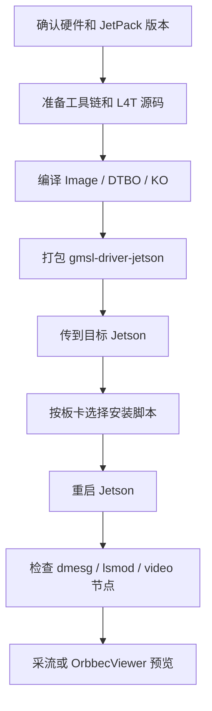

典型硬件链路：

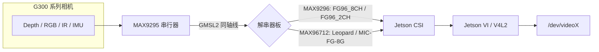

## 0. 先看懂两台机器

后续步骤会反复提到两台机器：

- 编译主机：通常是 x86 Ubuntu PC，用来下载源码、编译内核和驱动。
- 目标 Jetson：实际插 GMSL 转接板和 G300 相机的 Jetson 设备。

如果你的 Jetson 性能足够，也可以直接在 Jetson 上编译，但更推荐在 x86 Ubuntu PC 上交叉编译。

## 1. 准备硬件

1. 准备 Jetson 设备。

   AGX Orin 或 Orin NX 均可。

2. 准备 GMSL 解串板。

   根据你的硬件选择一种：

   - FG96_8CH_GMSL：AGX Orin 常用 8 路板，使用 MAX9296。
   - FG96_2CH：Orin NX 常用 2 路板，使用 MAX9296。
   - LI-JAG-ADP-GMSL2-8CH：Leopard 8 路板，使用 MAX96712。
   - MIC-FG-8G：研华 MIC-FG-8G 板，使用 MAX96712。

3. 准备 Orbbec G300 系列 GMSL 相机。

4. 连接硬件。

   - 先断电。
   - 把解串板接到 Jetson。
   - 把 GMSL 同轴线接到解串板和相机。
   - 确认相机供电、GMSL 线缆、板卡连接牢固。
   - 再给 Jetson 上电。

## 2. 确认 Jetson 系统版本

在目标 Jetson 上执行：

```bash
cat /etc/nv_tegra_release
uname -r
```

常见对应关系：

- JetPack 6.2：内核是 `5.15.148-tegra`
- JetPack 6.0：内核是 `5.15.136-tegra`

本文档默认以 JetPack 6.2 为例。JetPack 6.0 和 6.2 的具体差异见下一节。

### 2.1 JetPack 6.0 和 JetPack 6.2 差异

两者整体流程一样，都是：准备源码和工具链、编译、打包、传到 Jetson、运行目标安装脚本、重启验证。但版本号、源码地址、模块目录和打包方式不同。

| 项目 | JetPack 6.2 | JetPack 6.0 |
| --- | --- | --- |
| `build_all.sh` 参数 | `./build_all.sh 6.2 Linux_for_Tegra/source` | `./build_all.sh 6.0 Linux_for_Tegra/source` |
| L4T tag | `jetson_36.4.3` | `jetson_36.3` |
| 内核版本目录 | `5.15.148-tegra` | `5.15.136-tegra` |
| 工具链目录 | `l4t-gcc/6.2` | `l4t-gcc/6.0` |
| 源码包 URL | `r36_release_v4.3/sources/public_sources.tbz2` | `r36_release_v3.0/sources/public_sources.tbz2` |
| 推荐打包方式 | 使用 JP6.2 对应的 `copy_to_jetson_ssh.sh`，也可按第 7 节手动打包 | 使用 JP6.0 对应的 `copy_to_jetson_ssh.sh`，也可手动打包 |

如果使用 JetPack 6.0，本指南中的命令需要同步替换：

```bash
6.2 -> 6.0
5.15.148-tegra -> 5.15.136-tegra
r36_release_v4.3 -> r36_release_v3.0
```

注意：不同 JetPack 版本的仓库会提供对应版本的 `copy_to_jetson_ssh.sh`。使用前先确认脚本里的路径版本是否和你的编译版本一致，例如 JP6.2 应该使用 `images/6.2` 和 `5.15.148-tegra`，JP6.0 应该使用 `images/6.0` 和 `5.15.136-tegra`。

JetPack 6.0 / 6.2 操作差异示意：

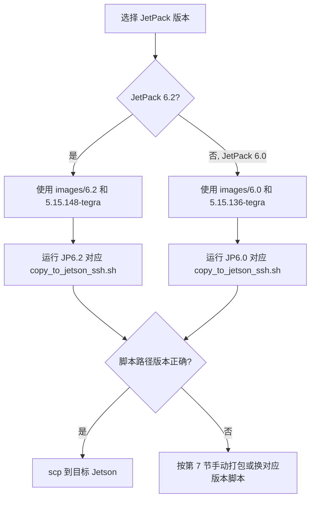

## 3. 在编译主机准备依赖

在编译主机上执行：

```bash
sudo apt update
sudo apt install -y build-essential bc flex bison libssl-dev libelf-dev git wget rsync
```

如果后面需要用 `scp` 传文件，还需要：

```bash
sudo apt install -y openssh-client
```

## 4. 准备交叉编译工具链

在编译主机、仓库根目录执行。假设仓库路径为：

```bash
cd /home/yanxiao/agx_orin
```

创建工具链目录：

```bash
mkdir -p l4t-gcc/6.2
cd l4t-gcc/6.2
```

下载并解压 NVIDIA Bootlin aarch64 工具链：

```bash
wget https://developer.nvidia.com/downloads/embedded/l4t/r36_release_v3.0/toolchain/aarch64--glibc--stable-2022.08-1.tar.bz2 -O aarch64--glibc--stable-final.tar.bz2
tar xf aarch64--glibc--stable-final.tar.bz2 --strip-components 1
cd ../..
```

检查工具链是否存在：

```bash
ls l4t-gcc/6.2/bin/aarch64-buildroot-linux-gnu-gcc
```

能看到文件路径就说明工具链准备好了。

JetPack 6.0 操作差异：

```bash
mkdir -p l4t-gcc/6.0
cd l4t-gcc/6.0
wget https://developer.nvidia.com/downloads/embedded/l4t/r36_release_v3.0/toolchain/aarch64--glibc--stable-2022.08-1.tar.bz2 -O aarch64--glibc--stable-final.tar.bz2
tar xf aarch64--glibc--stable-final.tar.bz2 --strip-components 1
cd ../..
ls l4t-gcc/6.0/bin/aarch64-buildroot-linux-gnu-gcc
```

## 5. 准备 NVIDIA L4T 源码

在编译主机、仓库根目录执行：

```bash
mkdir -p Linux_for_Tegra
cd Linux_for_Tegra
wget https://developer.nvidia.com/downloads/embedded/l4t/r36_release_v4.3/sources/public_sources.tbz2
tar xjf public_sources.tbz2
cd source
tar xjf kernel_src.tbz2
tar xjf kernel_oot_modules_src.tbz2
tar xjf nvidia_kernel_display_driver_source.tbz2
cd ../..
```

如果你的仓库里已经有 `Linux_for_Tegra/source/kernel/kernel-jammy-src`、`Linux_for_Tegra/source/nvidia-oot` 等目录，可以跳过本步骤。

检查源码目录：

```bash
ls Linux_for_Tegra/source/kernel/kernel-jammy-src
ls Linux_for_Tegra/source/nvidia-oot
```

JetPack 6.0 操作差异：

```bash
mkdir -p Linux_for_Tegra
cd Linux_for_Tegra
wget https://developer.nvidia.com/downloads/embedded/l4t/r36_release_v3.0/sources/public_sources.tbz2
tar xjf public_sources.tbz2
cd source
tar xjf kernel_src.tbz2
tar xjf kernel_oot_modules_src.tbz2
tar xjf nvidia_kernel_display_driver_source.tbz2
cd ../..
```

## 6. 编译内核、DTB 和 G300 驱动

在编译主机、仓库根目录执行：

```bash
cd /home/yanxiao/agx_orin
./build_all.sh 6.2 Linux_for_Tegra/source
```

如果不带参数，脚本默认也是 JetPack 6.2：

```bash
./build_all.sh
```

编译时间较长，正常情况会生成：

```bash
images/6.2/rootfs/boot/Image
images/6.2/rootfs/boot/*.dtbo
images/6.2/rootfs/lib/modules/5.15.148-tegra/updates/
```

检查关键产物：

```bash
ls images/6.2/rootfs/boot/Image
ls images/6.2/rootfs/boot/tegra234-p3737-camera-g300-fg96-overlay.dtbo
ls images/6.2/rootfs/boot/tegra234-p3737-camera-g300-nomtd-fg96-overlay.dtbo
ls images/6.2/rootfs/boot/tegra234-p3737-camera-g300-leopard-overlay.dtbo
ls images/6.2/rootfs/boot/tegra234-p3737-camera-g300-nomtd-leopard-overlay.dtbo
ls images/6.2/rootfs/boot/tegra234-p3737-camera-g300-mic-fg-8g-overlay.dtbo
ls images/6.2/rootfs/boot/tegra234-p3767-camera-p3768-g300-fg96-overlay.dtbo
ls images/6.2/rootfs/boot/tegra234-p3767-camera-p3768-g300-nomtd-fg96-overlay.dtbo
ls images/6.2/rootfs/lib/modules/5.15.148-tegra/updates/drivers/media/i2c/g300.ko
ls images/6.2/rootfs/lib/modules/5.15.148-tegra/updates/drivers/media/i2c/obc_max9296.ko
ls images/6.2/rootfs/lib/modules/5.15.148-tegra/updates/drivers/media/i2c/obc_max96712.ko
```

如果是 JetPack 6.0，编译命令和检查路径如下：

```bash
./build_all.sh 6.0 Linux_for_Tegra/source
ls images/6.0/rootfs/boot/Image
ls images/6.0/rootfs/boot/tegra234-p3737-camera-g300-fg96-overlay.dtbo
ls images/6.0/rootfs/boot/tegra234-p3737-camera-g300-nomtd-fg96-overlay.dtbo
ls images/6.0/rootfs/boot/tegra234-p3737-camera-g300-leopard-overlay.dtbo
ls images/6.0/rootfs/boot/tegra234-p3737-camera-g300-nomtd-leopard-overlay.dtbo
ls images/6.0/rootfs/boot/tegra234-p3737-camera-g300-mic-fg-8g-overlay.dtbo
ls images/6.0/rootfs/boot/tegra234-p3767-camera-p3768-g300-fg96-overlay.dtbo
ls images/6.0/rootfs/boot/tegra234-p3767-camera-p3768-g300-nomtd-fg96-overlay.dtbo
ls images/6.0/rootfs/lib/modules/5.15.136-tegra/updates/drivers/media/i2c/g300.ko
ls images/6.0/rootfs/lib/modules/5.15.136-tegra/updates/drivers/media/i2c/obc_max9296.ko
ls images/6.0/rootfs/lib/modules/5.15.136-tegra/updates/drivers/media/i2c/obc_max96712.ko
```

编译产物关系：

```mermaid
flowchart LR
    A[build_all.sh] --> B[Image]
    A --> C[DTBO: tegra234-*-g300-*.dtbo]
    A --> D[KO 模块]
    D --> D1[g300.ko]
    D --> D2[obc_max9296.ko]
    D --> D3[obc_max96712.ko]
    D --> D4[obc_cam_sync.ko]
    B --> E[gmsl-driver-jetson]
    C --> E
    D1 --> E
    D2 --> E
    D3 --> E
    D4 --> E
```

## 7. 打包要传到 Jetson 的文件

优先使用与当前 JetPack 版本匹配的 `copy_to_jetson_ssh.sh` 脚本打包。

使用前先检查脚本引用的版本路径：

```bash
grep -n "images/6\\.|5.15.*-tegra" copy_to_jetson_ssh.sh
```

如果你使用 JetPack 6.2，脚本里应该看到 `images/6.2` 和 `5.15.148-tegra`；如果你使用 JetPack 6.0，脚本里应该看到 `images/6.0` 和 `5.15.136-tegra`。

版本匹配时，直接执行：

```bash
sh copy_to_jetson_ssh.sh
```

该脚本会把对应 `images/<JetPack版本>` 下的产物拷贝到 `gmsl-driver-jetson`。如果脚本版本和你的编译版本不一致，请换用对应 JetPack 版本仓库里的脚本，或者继续按下面的备用流程手动打包。

备用手动打包流程如下，在编译主机、仓库根目录执行：

```bash
rm -rf gmsl-driver-jetson
mkdir -p gmsl-driver-jetson
```

复制启动文件和设备树覆盖：

```bash
cp images/6.2/rootfs/boot/Image gmsl-driver-jetson/
cp images/6.2/rootfs/boot/tegra234-*-g300-*.dtbo gmsl-driver-jetson/
```

复制驱动模块：

```bash
cp images/6.2/rootfs/lib/modules/5.15.148-tegra/updates/drivers/media/platform/tegra/camera/tegra-camera.ko gmsl-driver-jetson/
cp images/6.2/rootfs/lib/modules/5.15.148-tegra/updates/drivers/media/i2c/obc_max9296.ko gmsl-driver-jetson/
cp images/6.2/rootfs/lib/modules/5.15.148-tegra/updates/drivers/media/i2c/obc_max96712.ko gmsl-driver-jetson/
cp images/6.2/rootfs/lib/modules/5.15.148-tegra/updates/drivers/media/i2c/g300.ko gmsl-driver-jetson/
cp images/6.2/rootfs/lib/modules/5.15.148-tegra/updates/drivers/misc/obc_cam_sync.ko gmsl-driver-jetson/
cp images/6.2/rootfs/lib/modules/5.15.148-tegra/updates/drivers/platform/tegra/rtcpu/capture-ivc.ko gmsl-driver-jetson/
cp images/6.2/rootfs/lib/modules/5.15.148-tegra/updates/drivers/video/tegra/host/nvcsi/nvhost-nvcsi-t194.ko gmsl-driver-jetson/
cp images/6.2/rootfs/lib/modules/5.15.148-tegra/kernel/drivers/media/v4l2-core/videodev.ko gmsl-driver-jetson/
```

复制安装脚本：

```bash
cp copy_to_target_agx_orin_fg96.sh gmsl-driver-jetson/
cp copy_to_target_agx_orin_nomtd_fg96.sh gmsl-driver-jetson/
cp copy_to_target_agx_orin_leopard.sh gmsl-driver-jetson/
cp copy_to_target_agx_orin_nomtd_leopard.sh gmsl-driver-jetson/
cp copy_to_target_agx_orin_mic_fg_8g.sh gmsl-driver-jetson/
cp copy_to_target_agx_orin_leopard_obcam.sh gmsl-driver-jetson/
cp copy_to_target_orin_nx_fg96.sh gmsl-driver-jetson/
cp copy_to_target_orin_nx_nomtd_fg96.sh gmsl-driver-jetson/
cp reconnect.sh gmsl-driver-jetson/
```

检查打包目录：

```bash
ls gmsl-driver-jetson
```

至少应该看到：

```text
Image
g300.ko
obc_max9296.ko
obc_max96712.ko
obc_cam_sync.ko
tegra-camera.ko
videodev.ko
capture-ivc.ko
nvhost-nvcsi-t194.ko
copy_to_target_*.sh
tegra234-*-g300-*.dtbo
```

## 8. 把文件传到目标 Jetson

先在目标 Jetson 上查看 IP：

```bash
ip addr
```

假设 Jetson 用户名是 `nvidia`，IP 是 `192.168.1.100`。

在编译主机执行：

```bash
scp -r gmsl-driver-jetson nvidia@192.168.1.100:~/
```

传输完成后，登录 Jetson：

```bash
ssh nvidia@192.168.1.100
```

## 9. 在 Jetson 上选择正确安装脚本

在目标 Jetson 执行：

```bash
cd ~/gmsl-driver-jetson
ls
```

根据你的硬件组合选择一个脚本。

### 9.1 AGX Orin + FG96_8CH_GMSL（MAX9296）

常规方式：

```bash
sh copy_to_target_agx_orin_fg96.sh
```

如果你的相机使用“元数据在图像第一行”的方式：

```bash
sh copy_to_target_agx_orin_nomtd_fg96.sh
```

### 9.2 AGX Orin + Leopard LI-JAG-ADP-GMSL2-8CH（MAX96712）

常规方式：

```bash
sh copy_to_target_agx_orin_leopard.sh
```

如果你的相机使用“元数据在图像第一行”的方式：

```bash
sh copy_to_target_agx_orin_nomtd_leopard.sh
```

如果你明确要使用 `obcam.ko` 方案：

```bash
sh copy_to_target_agx_orin_leopard_obcam.sh
```

### 9.3 AGX Orin + MIC-FG-8G（MAX96712）

```bash
sh copy_to_target_agx_orin_mic_fg_8g.sh
```

### 9.4 Orin NX + FG96_2CH（MAX9296）

常规方式：

```bash
sh copy_to_target_orin_nx_fg96.sh
```

如果你的相机使用“元数据在图像第一行”的方式：

```bash
sh copy_to_target_orin_nx_nomtd_fg96.sh
```

安装脚本会做这些事情：

- 备份原始 `/boot/Image`
- 备份原始内核模块
- 复制新的 `Image`
- 复制新的 `.dtbo`
- 复制新的 `.ko`
- 调用 Jetson IO 使能 Orbbec Camera 设备树覆盖
- 执行 `depmod`

安装脚本选择图：

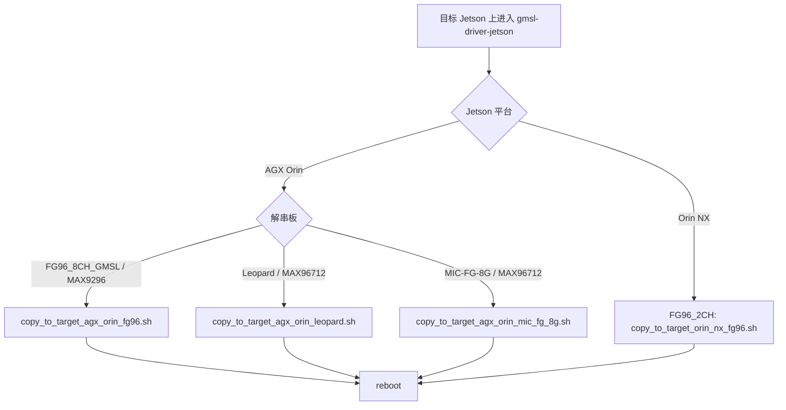

## 10. 重启 Jetson

安装完成后必须重启：

```bash
sudo reboot
```

重启后重新登录 Jetson。

## 11. 检查驱动是否加载

在目标 Jetson 执行：

```bash
lsmod | grep -E "g300|obc_max9296|obc_max96712|obc_cam_sync"
```

查看内核日志：

```bash
dmesg | grep -i g300
dmesg | grep -i orbbec
dmesg | grep -i max9296   # 如果使用的是Max9296的解串器，可以看到Max9296驱动打印的日志
dmesg | grep -i max96712  # 如果使用的是Max96712的解串器，可以看到Max96712驱动打印的日志
```

正常情况下，你应该能看到类似信息：

```text
Orbbec gmsl camera driver version
```

如果没有任何 G300 / Orbbec / MAX9296 / MAX96712 日志，优先检查：

- 安装脚本是否选错。
- Jetson 是否真的重启。
- `.dtbo` 是否被 Jetson IO 启用。
- lsmod | grep -E "g300|obc_max9296|obc_max96712|obc_cam_sync" 是否显示驱动已加载。

按板卡重点看对应解串器日志：

- FG96_8CH_GMSL / FG96_2CH：重点看 `max9296`。
- Leopard / MIC-FG-8G：重点看 `max96712`。

## 12. 检查视频节点

在目标 Jetson 安装工具：

```bash
sudo apt update
sudo apt install -y v4l-utils
```

查看视频设备：

```bash
v4l2-ctl --list-devices
ls /dev/video*
```

查看某个节点支持的格式：

```bash
v4l2-ctl -d /dev/video0 --list-formats-ext
```

如果 `/dev/video*` 不存在，说明驱动或设备树没有正常工作，先看第 17 节排查。

## 13. 采一帧图片验证

先选一个实际存在的视频节点，例如 `/dev/video0`。

在目标 Jetson 执行：

```bash
v4l2-ctl -d /dev/video0 --stream-mmap --stream-count=30 --stream-to=test.raw
```

如果命令能跑完并生成 `test.raw`，说明视频流基本可以工作。

查看文件大小：

```bash
ls -lh test.raw
```

如果文件大小为 0，说明没有拿到有效图像。

## 14. 使用 OrbbecViewer 预览

下载 OrbbecViewer 工具并解压。

下载地址：https://github.com/orbbec/OrbbecSDK_v2/releases/

在 Jetson 图形界面下进入解压目录，执行：

```bash
./OrbbecViewer
```

如果通过 SSH 登录且没有图形界面，OrbbecViewer 可能无法打开窗口。此时先用第 13 节的 `v4l2-ctl` 采流命令验证基础出图。

## 15. 重新加载 G300 驱动

如果只是想重新初始化链路，不想整机重启，可以在目标 Jetson 的 `~/gmsl-driver-jetson` 目录执行：

```bash
sh reconnect.sh
```

该脚本会卸载并重新插入：

- `obc_max9296.ko`
- `obc_max96712.ko`
- `g300.ko`

注意：如果相机正在被程序占用，卸载模块可能失败。先关闭使用相机的程序。

## 16. 非参考硬件如何修改设备树适配

如果你不使用本文档里的参考硬件，例如自研载板、自研 GMSL 解串板、I2C 走线不同、CSI 接口不同、复位 GPIO 不同、只接 1 路/2 路/4 路相机，都需要按实际硬件修改设备树。

设备树适配的本质是告诉驱动 4 件事：

- 解串器在哪个 I2C 总线上，I2C 地址是多少。
- 每个 G300 相机挂在解串器的哪个 GMSL link 上。
- 解串器输出接到 Jetson 哪个 CSI port，使用几条 lane，VC 怎么映射。
- 复位、同步、供电等 GPIO/控制信号怎么接。

设备树适配流程：

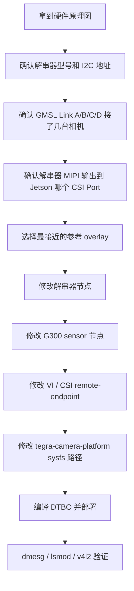

本仓库中 G300 驱动会从设备树读取这些关键字段：

| 字段 | 所在节点 | 作用 |
| --- | --- | --- |
| `compatible` | 解串器节点 | 选择 `obc_max9296` 或 `obc_max96712` 驱动 |
| `reg` | 解串器节点/相机节点 | I2C 7-bit 地址 |
| `nvidia,gmsl-dser-device` | G300 相机节点 | 指向对应的解串器节点，例如 `<&dser0>` |
| `dser-link-port` | G300 相机节点 | 相机接在解串器 link `a/b/c/d` 哪一路 |
| `st-vc` | G300 相机节点 | 相机原始输出 VC |
| `vc-id` | G300 相机节点和 endpoint | 送到 Jetson VI/CSI 的目标 VC |
| `orbbec_cam_num` | G300 相机节点 | 第几台物理 G300 相机，通常从 0 开始 |
| `cam-type` | G300 相机节点 | 当前 video 节点代表 `Depth/RGB/IR_L/IR_R` 哪个子流 |
| `port-index` | endpoint | Jetson CSI port 编号 |
| `bus-width` | endpoint | MIPI CSI lane 数 |
| `remote-endpoint` | endpoint | VI、CSI、sensor 三段链路互相连接 |
| `link_mask` | 解串器节点 | 哪些 GMSL link 实际接了 Orbbec 相机 |
| `seri-addr` | 解串器节点 | MAX9295 串行器 I2C 代理地址起始值 |
| `proxy-addr` | 解串器节点 | 驱动给相机分配的 I2C 代理地址起始值 |
| `real-addr` | 解串器节点 | G300 相机真实 I2C 地址，默认 `0x66` |
| `reset-gpios` | 解串器节点 | 解串器复位 GPIO |
| `csi-mode` / `num_lanes` / `mipi_rate` | 解串器节点 | 解串器 MIPI 输出配置 |

### 16.1 先选择最接近的参考模板

不要从零开始写 DTS，先复制最接近你硬件的 overlay：

| 你的硬件更接近 | 建议参考 |
| --- | --- |
| 使用 MAX9296，2 link 解串器，类似 FG96 | `tegra234-p3737-camera-g300-fg96-overlay.dts` 或 `tegra234-p3767-camera-p3768-g300-fg96-overlay.dts` |
| 使用 MAX96712，4 link 解串器，类似 Leopard | `tegra234-p3737-camera-g300-leopard-overlay.dts` |
| 使用 MAX96712，类似 MIC-FG-8G | `tegra234-p3737-camera-g300-mic-fg-8g-overlay.dts` |
| 元数据放在图像第一行 | 参考 `nomtd` 版本 overlay |

建议复制成新文件，例如：

```bash
cd Linux_for_Tegra/source/hardware/nvidia/t23x/nv-public/overlay
cp tegra234-p3737-camera-g300-leopard-overlay.dts tegra234-p3737-camera-g300-custom-overlay.dts
```

如果要让 `build_all.sh` 自动复制新的 `.dtbo`，还需要把新 overlay 加到对应 Makefile/构建规则里；否则可以先手动编译该 DTS，再手动拷贝 `.dtbo`。

### 16.2 先画出硬件连接表

改设备树前，先把硬件信息整理成表。没有这张表，后面很容易把 link、VC、CSI port 改乱。

| 项目 | 例子 | 你需要确认 |
| --- | --- | --- |
| Jetson 平台 | AGX Orin / Orin NX | 使用哪个 module 和 carrier |
| 解串器型号 | MAX9296 / MAX96712 | 决定 `compatible` 和参考模板 |
| 解串器 I2C 总线 | `i2c@3180000` / `i2c@31e0000` | 原理图和 `i2cdetect -l` 对应 |
| 解串器 I2C 地址 | MAX9296 常见 `0x48`，MAX96712 常见 `0x29` | 对应 DTS 的 `reg` |
| 是否有 I2C mux | FG96 有 `tca9546@70` | 自研板是否有 mux，通道号是多少 |
| 解串器 reset GPIO | `CAM0_PWDN` 等 | 原理图 GPIO 编号和极性 |
| 解串器输出 CSI | `serial_a/c/e/g` 等 | 接到 Jetson 哪个 CSI connector |
| MIPI lane 数 | 2 lane / 4 lane | 对应 `bus-width` 和 `num_lanes` |
| GMSL link 接线 | Link A/B/C/D | 对应 `dser-link-port` 和 `link_mask` |
| 每台相机编号 | 0/1/2/3... | 对应 `orbbec_cam_num` |
| 相机真实 I2C 地址 | 固定为 `0x66` | 对应 `real-addr` |
| 串行器代理地址规划 | MAX9296 默认 `0x50~0x51`，MAX96712 默认 `0x48~0x4B` | 对应 `seri-addr`，需要确认是否和板上其他 I2C 设备冲突 |
| 代理地址规划 | MAX9296 默认 `0x1a~0x1b`，MAX96712 默认 `0x20~0x23` | 对应 `proxy-addr`，需要确认代理地址是否被占用 |
| 同步信号 | FSYNC/PPS/MFP | 对应 `fsync_mfp_index`、`pps_mfp_index`、`pps-gpios` |

在 Jetson 上可以用这些命令辅助确认 I2C：

```bash
i2cdetect -l
sudo i2cdetect -y <bus>
```

如果解串器地址扫不到，先不要改 VI/CSI，优先检查供电、复位 GPIO、I2C 总线号、I2C mux 通道和地址。

### 16.3 修改解串器节点

解串器节点是适配新硬件的第一重点。

MAX9296 示例：

```dts
dser0: max9296@48 {
    status = "okay";
    reg = <0x48>;
    compatible = "maxim,obc_max9296";
    index = <0>;
    csi-mode = "2x4";
    num_lanes = "4";
    mipi_rate = <15>;
    seri-addr = <0x50>;
    proxy-addr = <0x1a>;
    real-addr = <0x66>;
    reset-gpios = <&gpio CAM0_PWDN GPIO_ACTIVE_HIGH>;
    fsync_mfp_index = <6>;
    pps_mfp_index = <9>;
    link_mask = <0x03>;
    vdd_supply_1v2;
};
```

MAX96712 示例：

```dts
dser0: max96712@29 {
    status = "okay";
    reg = <0x29>;
    compatible = "maxim,obc_max96712";
    index = <0>;
    csi-mode = "2x4";
    num_lanes = "4";
    mipi_rate = <15>;
    port_a_clk = "CKC";
    is_port_b_connected;
    seri-addr = <0x48>;
    proxy-addr = <0x20>;
    real-addr = <0x66>;
    reset-gpios = <&gpio CAM0_PWDN GPIO_ACTIVE_HIGH>;
    fsync_mfp_index = <2>;
    pps_mfp_index = <9>;
    link_mask = <0x0F>;
    vdd_supply_1v2;
};
```

字段修改原则：

- `compatible`：MAX9296 使用 `"maxim,obc_max9296"`；MAX96712 使用 `"maxim,obc_max96712"`。
- `reg`：写解串器实际 7-bit I2C 地址。比如 8-bit 地址 `0x90` 对应 7-bit `0x48`。
- `index`：同类型多颗解串器时递增，建议从 0 开始。
- `reset-gpios`：解串器 PWDNB 引脚按载板原理图修改 GPIO，极性也要确认。
- `link_mask`：按实际接入 Orbbec 相机的 link 设置。
- `seri-addr`：MAX9295 串行器的 I2C 代理地址起始值。驱动会按 link 递增分配串行器地址，例如起始值为 `0x48` 时，Link A/B/C/D 对应 `0x48/0x49/0x4a/0x4b`。该值不是解串器自身地址，解串器自身地址由节点名和 `reg` 决定。适配新硬件时要确认这些代理地址没有和同一 I2C 总线上的其他设备冲突。
- `proxy-addr`：G300 相机 I2C 代理地址起始值。驱动会按 link 递增分配相机代理地址，例如起始值为 `0x20` 时，Link A/B/C/D 对应 `0x20/0x21/0x22/0x23`。该地址用于通过 GMSL I2C 通道访问相机，不能和 `seri-addr` 规划出的串行器代理地址或同一 I2C 总线上的其他设备冲突。
- `real-addr`：G300 默认真实地址固定是 `0x66`，除非固件或硬件另有修改。
- `csi-mode`：表示解串器 MIPI PHY/Port 的输出模式，必须和解串器到 Jetson 的硬件连接一致。`2x4` 表示使用 2 个 CSI PHY 输出，每个 PHY 最多 4 条 DATA lane；`4x2` 表示使用 4 个 CSI PHY 输出，每个 PHY 最多 2 条 DATA lane。

  很多人会误以为 `2x4` 一定等于实际使用 4 条 DATA lane。实际不是这样：`2x4` 描述的是 PHY 输出模式，每个 PHY 最大支持 4 lane，实际可以按硬件连接使用 1/2/3/4 lane，常见配置是 2 lane 或 4 lane。

  MAX96712 有 4 个 PHY。如果硬件连接满足条件，可以选择 `2x4` 或 `4x2`：

  2x4 Lane 模式：

  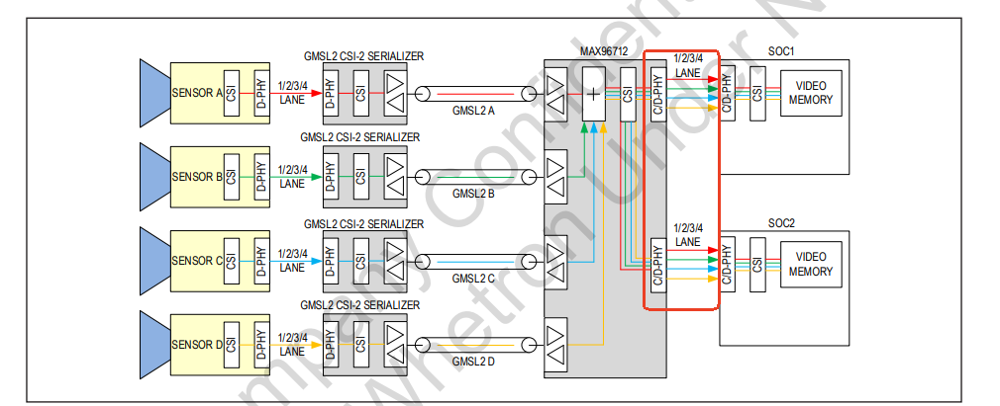

  4x2 Lane 模式：

  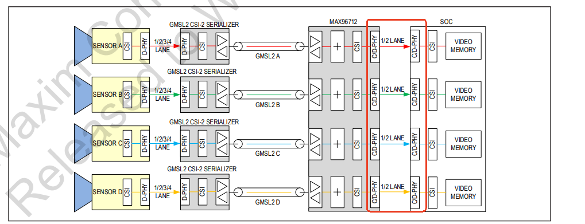

  MAX96712 CSI 连接参考：

  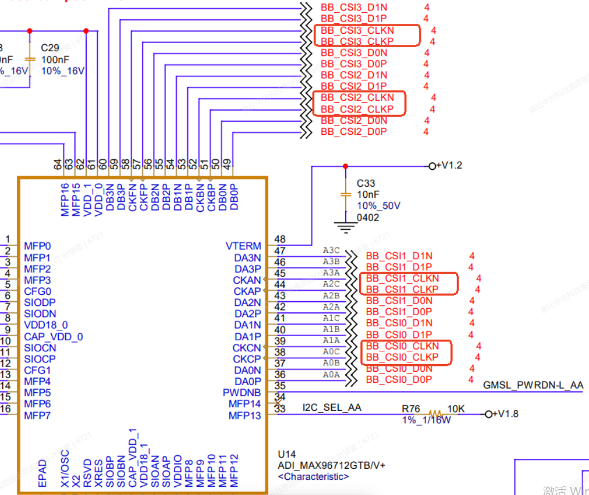

  MAX9296 只有 2 个 PHY 和 2 个 CLOCK lane，只能使用 `2x4` 模式：

  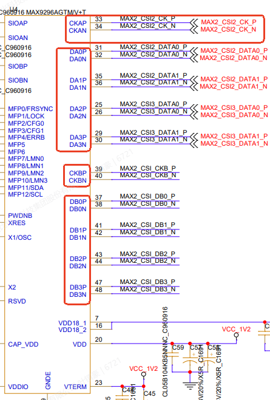

- `num_lanes`：与解串器每个 CSI Port 的 DATA lane 数一致。`num_lanes = "4"` 表示 4 lane。
- `mipi_rate`：解串器 MIPI 输出速率 `mipi_rate = <15>` 表示 1.5 Gbps/lane。
- `port_a_clk`：MAX96712 相关，按实际原理图配置。以 Jetson CSI 0/1 与 MAX96712 Port A 连接为例，如果 CSI 0 的 CLK lane 接 MAX96712 CKC，则配置 `port_a_clk = "CKC"`；如果 CSI 0 的 CLK lane 接 MAX96712 CKA，则配置 `port_a_clk = "CKA"`。需要注意：CSI 0 的 CLK lane 如果接 CKA，通常只能使用 `2x4` 模式；只有 CSI 0 的 CLK lane 接 CKC，且 CSI 1 的 CLK lane 接 CKA 时，才具备同时选择 `2x4` 和 `4x2` 模式的硬件条件。
- `is_port_b_connected`：MAX96712 相关，按实际原理图确认 MAX96712 Port B 是否连接 Jetson CSI。已连接则保留 `is_port_b_connected`，未连接则注释或删除。

`link_mask` 常用值：

| 实际接入 link | `link_mask` |
| --- | --- |
| 只接 Link A | `<0x01>` |
| 只接 Link B | `<0x02>` |
| Link A + B | `<0x03>` |
| Link A + B + C + D | `<0x0F>` |

### 16.4 修改 G300 相机节点

每个 G300 物理相机通常会生成多个 video 子流节点，例如 Depth、RGB、IR_L、IR_R。它们的 `orbbec_cam_num` 相同，但 `cam-type`、`vc-id`、`remote-endpoint` 不同。

单台 G300 的子流示意：

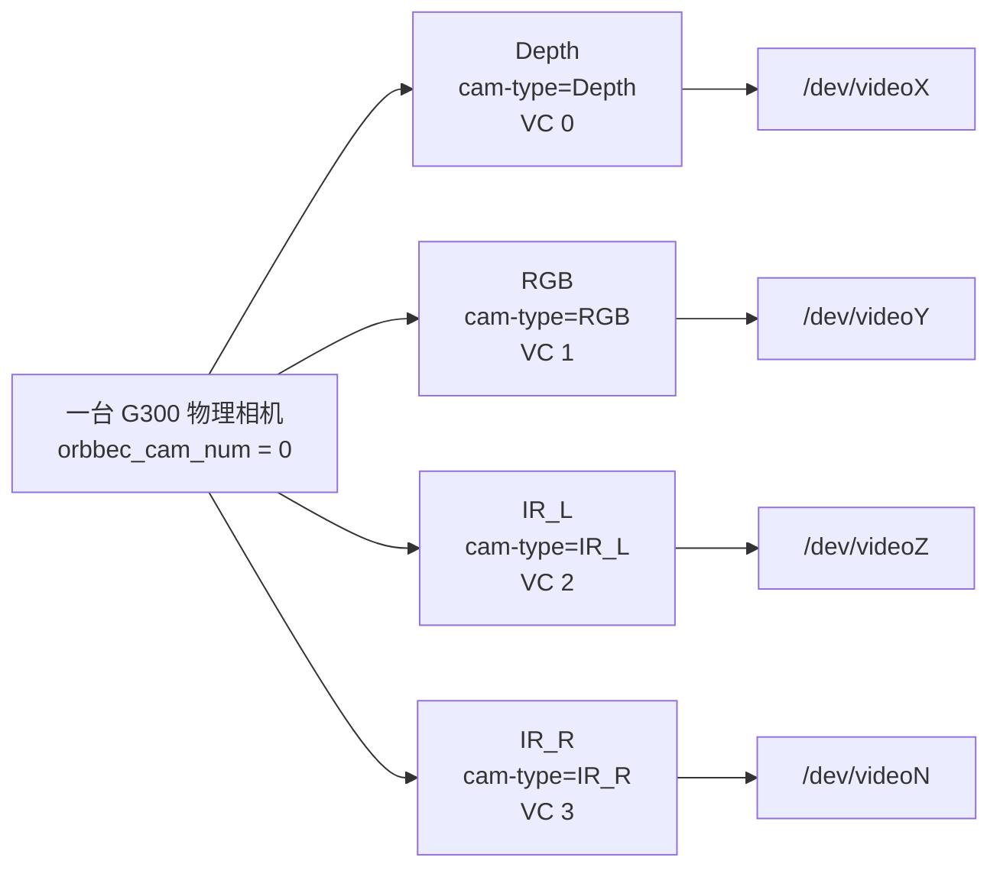

典型 G300 子节点结构：

```dts
g2m0_0: g2m0@66 {
    status = "okay";
    reg = <0x66>;
    compatible = "orbbec,g300";
    use_sensor_mode_id = "true";
    vcc-supply = <&vdd_1v8_ls>;
    cam-type = "Depth";
    dser-link-port = "a";
    st-vc = <0>;
    vc-id = <0>;
    orbbec_cam_num = <0>;
    nvidia,gmsl-dser-device = <&dser0>;

    ports {
        port@0 {
            reg = <0>;
            g2m0_0_out: endpoint {
                vc-id = <0>;
                port-index = <0>;
                bus-width = <4>;
                remote-endpoint = <&g300_csi_in0>;
            };
        };
    };

    mode0 {
        embedded_metadata_height = "1";
    };
};
```

字段修改原则：

- `reg`：相机节点在当前设备树/I2C 视角下使用的 7-bit 地址。参考 overlay 中会用 `0x66`、`0x67` 等地址区分多个代理节点；适配新硬件时要避免和同一 I2C 总线上的其他设备冲突。
- `cam-type`：必须按子流填写，常见 `Depth`、`RGB`、`IR_L`、`IR_R`。
- `dser-link-port`：相机节点分配给物理上哪个 GMSL link 的相机。Link A/B/C/D 分别写 `"a"`、`"b"`、`"c"`、`"d"`。
- `st-vc`：相机侧原始 VC。固定配置按 `Depth`、`RGB`、`IR_L`、`IR_R` 0/1/2/3 分配。
- `vc-id`：经解串器映射后的 Jetson 接收侧 VC，要和 endpoint、VI 端保持一致，参考 overlay 中 Link A/B/C/D 各子流的 `vc-id` 映射关系即可，如有特殊需求可联系我们 FAE 沟通后再修改。
- `orbbec_cam_num`：同一台物理 G300 的所有子流必须一致；不同物理相机递增。
- `nvidia,gmsl-dser-device`：必须指向实际连接的解串器节点，例如 `<&dser0>`、`<&dser1>`。
- `port-index`：Jetson CSI port，必须按实际 MIPI 接口修改。
- `bus-width`：CSI lane 数，必须和硬件 lane 数一致。
- `remote-endpoint`：必须和 CSI 那边成对互指，名字改了两边都要改。
- `embedded_metadata_height`：普通参考配置为 `"1"`，代表元数据（metadata）作为单独 EMB8 通道传输；配置为 `"0"`，代表元数据（metadata）嵌入到视频数据的第一行中。Gemini 345Lg / Dabai AL 代码里会强制按相机能力处理。

### 16.5 Link / Pipe / CSI 数据流关系

G300 每台物理相机最多对应 4 路视频子流。代码中固定按 `cam-type` 选择相机内部子流，按 `st-vc` 作为相机侧源 VC，按 `vc-id` 作为解串器输出到 Jetson 的目标 VC。开流时，`g300.ko` 会调用串行器 MAX9295 和解串器的 `set_pipe()` 建立映射。

四路视频的默认含义如下：

| 子流 | `cam-type` | 相机侧源 VC，`st-vc` | 串行器 stream / pipe | 常用目标 VC，`vc-id` |
| --- | --- | --- | --- | --- |
| Depth | `"Depth"` | `<0>` | stream 0 / pipe X | `<0>` 或参考 DTS 中该 link 的 Depth VC |
| RGB | `"RGB"` | `<1>` | stream 1 / pipe Y | `<1>` 或参考 DTS 中该 link 的 RGB VC |
| IR_L | `"IR_L"` | `<2>` | stream 2 / pipe Z | `<2>` 或参考 DTS 中该 link 的 IR_L VC |
| IR_R | `"IR_R"` | `<3>` | stream 3 / pipe U | `<3>` 或参考 DTS 中该 link 的 IR_R VC |

驱动里的 pipe 选择规则：

| 解串器 | Link 数 | 解串器 pipe 选择 | CSI 输出选择 |
| --- | --- | --- | --- |
| MAX9296 | Link A/B | `pipe_id = vc-id`，有效 pipe 为 0~3 | 由解串器节点的 `csi-mode`/`num_lanes` 和 sensor/CSI endpoint 的 `port-index` 决定 |
| MAX96712 | Link A/B/C/D | Link A/B 使用 `pipe_id = vc-id`；Link C/D 使用 `pipe_id = 4 + vc-id`；如果 2x4 且只接一个 CSI Port，驱动会把 4~7 折回 0~3 | 2x4 且 `is_port_b_connected` 时，Link A/B 到 Port A，Link C/D 到 Port B；4x2 时通常 Link A/B/C/D 分别到 4 个 CSI 控制器 |

注意：`st-vc` 是相机送入串行器/解串器前的源 VC，`vc-id` 是解串器输出给 Jetson 的目标 VC。设备树里的 sensor endpoint、NVCSI endpoint、VI endpoint 的 `vc-id` 必须保持一致，否则可能有 `/dev/video*` 但采流失败。

MAX9296 参考数据流，适合 FG96/2CH 这类 2 link 解串器：

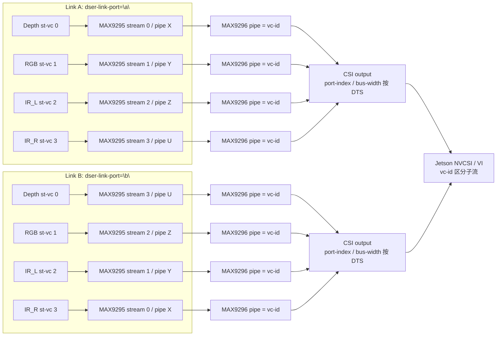

MAX9296 参考 overlay 里常见做法是：同一个 link 的四路子流进入同一个 `port-index`，再用 `vc-id` 区分 Depth/RGB/IR_L/IR_R；不同 MAX9296 芯片或不同物理输出再分配到不同 `port-index`。如果只启用 Link A，通常保持 Depth/RGB/IR_L/IR_R 的 `vc-id = 0/1/2/3` 最直观；Link B，通常保持 Depth/RGB/IR_L/IR_R 的 `vc-id = 3/2/1/0`：目的是Link A 和 Link B 可以同时开启 Depth 和 RGB 。如果 Link A 和 Link B 共用同一条 CSI 输出和一个解串器，两台相机无法四路全开，Jetson 单条 CSI 只有 VC0~VC3 会不够用,解串器的PIPE 数量也不够用。

MAX96712 参考数据流，适合 Leopard/MIC-FG-8G 这类 4 link 解串器：

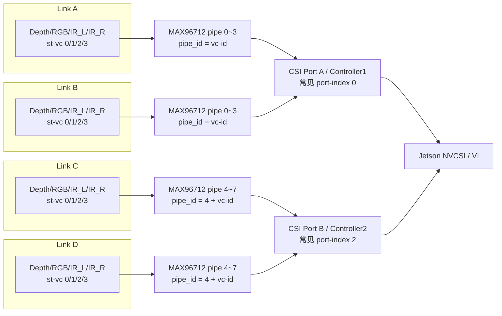

MAX96712 在 `csi-mode = "2x4"` 且保留 `is_port_b_connected` 时，驱动会把 Link A/B 的 pipe 映射到一个 CSI 输出，把 Link C/D 的 pipe 映射到另一个 CSI 输出。参考 Leopard overlay 中常见组合是 Link A/B 使用 `port-index = <0>`，Link C/D 使用 `port-index = <2>`；如果板上还有第二颗 MAX96712，则再使用后续 CSI port，例如 `<4>`、`<6>`。

如果 MAX96712 使用 `csi-mode = "4x2"`，且保留 `is_port_b_connected`，数据流可以理解为每个 link 更接近独立 CSI 控制器：

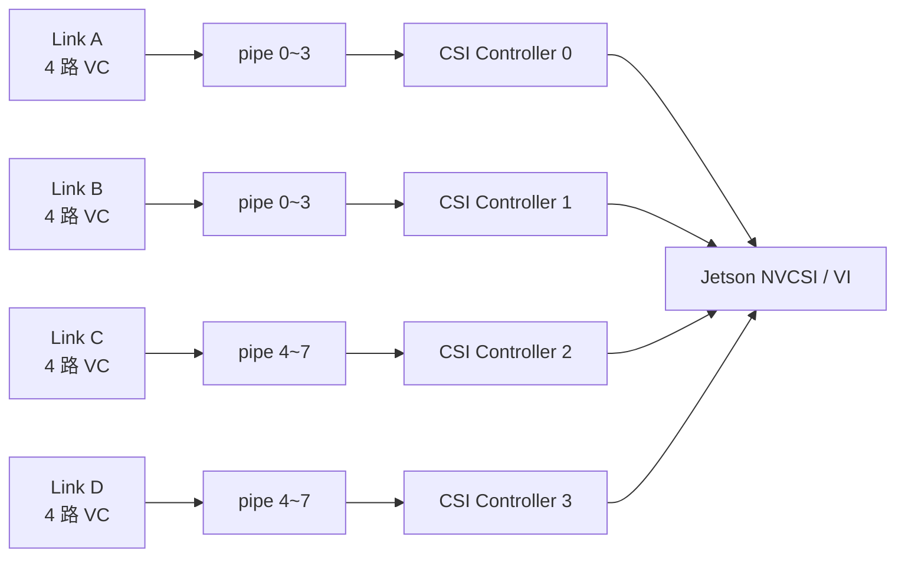

如果 MAX96712 使用 `csi-mode = "4x2"`，但注释或删除 `is_port_b_connected`，驱动会按两组 CSI 控制器输出：Link A/B 映射到 Controller0，Link C/D 映射到 Controller1。此时同一组里的两个 link 需要通过 `vc-id` 和设备树 endpoint 拓扑区分，不能简单理解为 4 个 link 各占一个独立 CSI 输出。

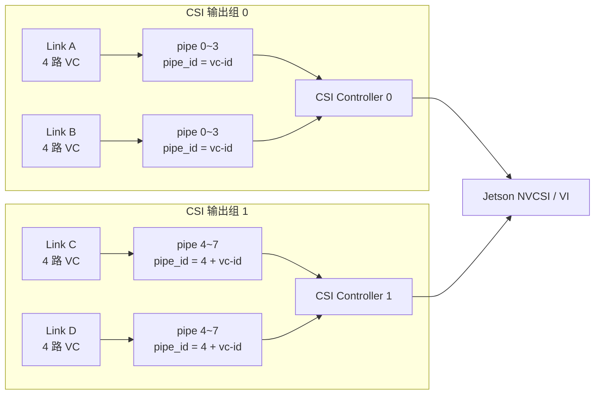

不同 link 的 `vc-id` 在参考 DTS 中不一定都按 Depth/RGB/IR_L/IR_R 顺序写成 0/1/2/3。我们参考模板会把 Link B 或 Link D 的目标 VC 反向排列，目的是四个Link上的相机可以同时开启 Depth 和 RGB 。适配新硬件时，不要只看 `cam-type`，要把同一子流在 sensor endpoint、NVCSI input endpoint、VI endpoint 三处的 `vc-id`、`port-index`、`bus-width` 一起核对。

### 16.6 修改 VI/CSI 拓扑

G300 视频链路在设备树里分三段：

```text
G300 sensor endpoint -> NVCSI input endpoint -> NVCSI output endpoint -> VI endpoint
```

设备树 endpoint 互连关系：

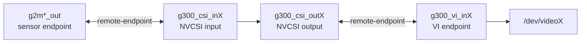

这三段靠 `remote-endpoint` 互相连接。适配新硬件时，必须保证：

- sensor endpoint 的 `remote-endpoint` 指向正确的 `g300_csi_inX`。
- `g300_csi_inX` 的 `remote-endpoint` 反向指回 sensor endpoint。
- `g300_csi_outX` 的 `remote-endpoint` 指向 `g300_vi_inX`。
- `g300_vi_inX` 的 `remote-endpoint` 反向指回 `g300_csi_outX`。
- 同一条链路上的 `vc-id`、`port-index`、`bus-width` 不要互相矛盾。

如果你的新硬件只接 1 台或 2 台相机，可以从参考 overlay 中删掉不用的 G300 sensor 节点、对应的 CSI/VI endpoint 和 `tegra-camera-platform` module 条目，也可以先把不用的 sensor 节点 `status = "disabled"`。新手建议先禁用，调通后再精简。

`port-index` 要按 Jetson 实际 CSI port 连接修改。参考 overlay 中常见映射：

| `tegra_sinterface` | 常见 `port-index` |
| --- | --- |
| `serial_a` | `<0>` |
| `serial_c` | `<2>` |
| `serial_e` | `<4>` |
| `serial_g` | `<6>` |

注意：这是参考板上的映射，不是所有载板都一定相同。自研载板必须以原理图和 NVIDIA 对应平台 DTS 为准。

### 16.7 修改 tegra-camera-platform

`tegra-camera-platform` 用来让 NVIDIA camera framework 知道有哪些 camera module 和 sysfs 路径。自研硬件改 I2C 总线、mux 或相机地址后，这里的 `sysfs-device-tree` 也要同步改。

参考 FG96 中路径类似：

```dts
sysfs-device-tree = "/sys/firmware/devicetree/base/bus@0/i2c@3180000/tca9546@70/i2c@0/g2m0@66";
```

参考 Leopard/MIC 中路径类似：

```dts
sysfs-device-tree = "/sys/firmware/devicetree/base/bus@0/i2c@31e0000/g2m0@66";
```

修改原则：

- 如果有 I2C mux，路径里要包含 mux 节点和通道，例如 `tca9546@70/i2c@0`。
- 如果没有 I2C mux，路径直接到对应 `i2c@.../g2m...@xx`。
- `@xx` 要和 G300 sensor 节点的 `reg` 一致。
- `badge`、`position`、`orientation` 可以按实际相机位置修改，但不影响最基础 probe。

如果这里路径不对，可能会出现设备节点不完整、V4L2 枚举异常等问题。

### 16.8 修改同步和复位信号

参考 overlay 里常见这些宏和字段：

```dts
#define CAM0_PWDN TEGRA234_MAIN_GPIO(H, 6)

reset-gpios = <&gpio CAM0_PWDN GPIO_ACTIVE_HIGH>;
fsync_mfp_index = <2>;
pps_mfp_index = <9>;
```

适配新硬件时：

- `CAMx_PWDN` 要改成解串器真实 PWDNB GPIO。
- 如果 reset 极性相反，要改 `GPIO_ACTIVE_HIGH` / `GPIO_ACTIVE_LOW`。
- `fsync_mfp_index` 和 `pps_mfp_index` 要按解串器 MFP 接线修改。
- 如果同步信号没有接，不影响基础出图。建议先按参考配置保留，基础出图调通后再处理同步。

### 16.9 编译并替换新的 DTBO

修改 DTS 后重新编译：

```bash
./build_all.sh 6.2 Linux_for_Tegra/source
```

也可以只编译设备树，具体命令取决于当前源码布局。JP6.2 常见输出路径：

```bash
Linux_for_Tegra/source/kernel-devicetree/generic-dts/dtbs/*.dtbo
```

JP6.0 常见输出路径：

```bash
Linux_for_Tegra/source/nvidia-oot/device-tree/platform/generic-dts/dtbs/*.dtbo
```

把新的 `.dtbo` 拷贝到 `gmsl-driver-jetson` 后，目标 Jetson 上安装脚本也要改成复制你的新文件名。例如：

```bash
sudo cp tegra234-p3737-camera-g300-custom-overlay.dtbo /boot/tegra234-p3737-camera-g300-overlay.dtbo
sudo /opt/nvidia/jetson-io/config-by-hardware.py -n 2="Jetson Orbbec Camera G335Lg"
sudo depmod
sudo reboot
```

如果你修改了 overlay-name，也要同步修改 `config-by-hardware.py -n` 后面的名称。

### 16.10 新硬件适配验证顺序

不要一上来就看 `/dev/video*`，建议按下面顺序验证：

1. 验证解串器 I2C 是否能扫到：

   ```bash
   i2cdetect -l
   sudo i2cdetect -y <bus>
   ```

2. 验证 overlay 是否启用：

   ```bash
   ls /boot | grep g300
   grep -n "FDTOVERLAYS" /boot/extlinux/extlinux.conf
   ```

3. 验证解串器驱动 probe：

   ```bash
   dmesg | grep -i max9296
   dmesg | grep -i max96712
   ```

4. 验证 G300 节点解析：

   ```bash
   dmesg | grep -i "g300 devicetree parse"
   dmesg | grep -i "orbbec gmsl"
   ```

5. 验证视频节点：

   ```bash
   v4l2-ctl --list-devices
   ls /dev/video*
   ```

6. 验证采流：

   ```bash
   v4l2-ctl -d /dev/video0 --stream-mmap
   ```

### 16.11 常见适配错误

| 现象 | 优先检查 |
| --- | --- |
| `missing deserializer i2c client` | `nvidia,gmsl-dser-device` 指向的 `dserX` 不存在或解串器节点未 probe |
| `missing deserializer driver` | `compatible` 写错，或对应 `.ko` 没安装/没加载 |
| `No serdes-csi-link found` | G300 节点缺少 `dser-link-port` |
| `No vc-id info` / `No st-vc info` | G300 节点缺少 VC 配置 |
| `orbbec_cam_num not found` | G300 节点缺少 `orbbec_cam_num` |
| 解串器能 probe，但相机无图 | `link_mask`、`dser-link-port`、线缆 link 顺序、proxy 地址 |
| 有 `/dev/video*` 但采流失败 | `port-index`、`bus-width`、`vc-id`、`remote-endpoint` |
| 只有部分相机有图 | 对应 link 的 `link_mask`、GMSL 线缆、相机供电、VC 映射 |
| Jetson IO 找不到 overlay | `overlay-name` 和安装脚本 `config-by-hardware.py -n` 名称不一致 |

最稳妥的适配策略是：先只启用 1 台相机、1 个解串器、1 条 CSI 输出，确认能出图后，再扩展到多 link、多相机、多解串器。

## 17. 常见问题排查

### 17.1 编译时报找不到交叉编译器

现象：

```text
aarch64-buildroot-linux-gnu-gcc: No such file or directory
```

处理：

```bash
ls l4t-gcc/6.2/bin/aarch64-buildroot-linux-gnu-gcc
```

如果不存在，回到第 4 节重新下载工具链。

### 17.2 安装脚本找不到 `.ko`

现象：

```text
cp: cannot stat 'g300.ko': No such file or directory
```

处理：

确认你在 Jetson 的正确目录：

```bash
cd ~/gmsl-driver-jetson
ls g300.ko obc_max9296.ko obc_max96712.ko
```

如果文件不存在，回到第 7 节重新打包并传输。

### 17.3 安装脚本提示 `.dtb cannot stat`

现象：

```text
cp: cannot stat 'tegra234-xxxx.dtb': No such file or directory
```

处理：

如果只是缺少 `.dtb`，但 `Image`、`.dtbo`、`g300.ko`、对应解串器 `.ko` 等文件都已复制，通常可以继续完成安装并重启验证。

如果重启后没有视频节点，再回到编译产物里确认是否需要同步基础 DTB。

### 17.4 Jetson 重启后没有 `/dev/video*`

按顺序检查：

```bash
dmesg | grep -i orbbec
dmesg | grep -i g300
dmesg | grep -i max9296
dmesg | grep -i max96712
lsmod | grep g300
ls /boot | grep g300
```
查看Dmesg日志，确认驱动加载是否有报错,从dmesg log中的报错找到video 节点注册失败的原因

重点看：

- 是否选错安装脚本。
- 解串板型号是否和脚本匹配。
- GMSL 线缆是否松动（解串器 寄存器 LOCKED 是否置位，LOCK 引脚是否为低电平）。
- 相机是否上电(POC 是否上电)。
- Gemini 335Lg 相机拨码开关是否拨打率 MIPI 端。

### 17.5 能打开视频节点，但相机无图

优先检查：

- 相机对应 link 的线缆和供电。
- 查看dmesg 日志，确认是否有i2c报错或其他异常报错，如果报Timeout请按照下面步骤继续排查。
- 读取Max9295D 开启数据流对应的PIPE X/Y/Z/U 的状态寄存器0x102/0x10A/0x112/0x11A，确认最高位bit[7]:PCLKDET是否有置位，如果有置位，说明相机数据流输出正常，否则说明数据流输出异常。
- 读取解串器Max9296/Max96712， 开启数据流对应的PIPE状态寄存器（Max9296:0x108/0x11A/0x12C/0x13E，Max96712:0x102/0x10A/0x112/0x11A），确认bit[6]:VID_LOCKED是否有置位。
- 查看开启的数据流是否与别的相机冲突。开流有如下限制：
   - 接在同一Max9296、Max96712 LinkA/B 、Max96712 LinkC/D 上的两个相机使用有以下限制
      -  驱动版本v1.2.02前限制为一个相机的RGB 跟另一个相机的右IR 不能同时开流,驱动版本v1.2.02后修改限制为一个相机的RGB 跟另一个相机的左IR 不能同时开流
      -  驱动版本v1.2.02前限制为一个相机的DEPTH 跟另一个相机的左IR 不能同时开流，驱动版本v1.2.02后修改限制为一个相机的DEPTH 跟另一个相机的右IR 不能同时开流
      -  两个相机加起来最多开4路流（同时满足前两个条件即满足这个条件）
- 检查设备树解串器节点配置是否与实际原理一致。如确认Max96712 csi-mode 原理图设计是否支持(Max9296 只支持 2*4 lane 模式)，num_lanes 每个csi port lane 数原理图是否支持。
- 检查原理图csi lane 极性是否相反，如果data lane 极性相反，需要在设备树中mode0节点配置 `lane_polarity`；如果clk lane 极性相反，需要修改解串器MIPI PHY5/6 寄存器 phyx_pol_map配置。
- 检查设备树中G300 sensor endpoint -> NVCSI input endpoint -> NVCSI output endpoint -> VI endpoint是否正确。
- 检查MIPI走线信号质量是否正常，可以降低MIPI时钟频率(修改解串器节点 `clk_rate` 配置)，检查是否能出图。

### 17.6 想恢复原始内核或模块

安装脚本会把原文件备份为 `.orig`，例如：

```text
/boot/Image.orig
/boot/dtb/kernel_*.dtb.orig
/lib/modules/$(uname -r)/updates/.../*.ko.orig
```

恢复时，把 `.orig` 文件复制回原文件名，然后执行：

```bash
sudo depmod
sudo reboot
```

恢复前请确认路径和文件名，不要盲目覆盖。

## 18. 首次适配推荐完整流程

如果你不知道该怎么选，按下面流程走：

1. 确认 Jetson 是 JetPack 6.2。
2. 在编译主机安装依赖。
3. 下载 `l4t-gcc/6.2` 工具链。
4. 准备 `Linux_for_Tegra/source`。
5. 执行：

   ```bash
   ./build_all.sh 6.2 Linux_for_Tegra/source
   ```

6. 运行 JP6.2 对应的 `copy_to_jetson_ssh.sh` 打包 `gmsl-driver-jetson`；如果脚本版本不匹配，按第 7 节手动打包。
7. 用 `scp` 传到 Jetson。
8. 根据硬件选择安装脚本。
9. `sudo reboot`。
10. 用 `dmesg`、`lsmod`、`v4l2-ctl` 检查。
11. 用 `v4l2-ctl --stream-mmap` 采帧验证。

如果是 JetPack 6.0，把上面的 `6.2` 换成 `6.0`，模块目录按 `5.15.136-tegra` 检查，并使用 JP6.0 对应的 `copy_to_jetson_ssh.sh`。

## 19. 脚本选择速查表

| Jetson | 解串板 | 解串器 | 推荐脚本 |
| --- | --- | --- | --- |
| AGX Orin | FG96_8CH_GMSL | MAX9296 | `copy_to_target_agx_orin_fg96.sh` |
| AGX Orin | FG96_8CH_GMSL，元数据在第一行 | MAX9296 | `copy_to_target_agx_orin_nomtd_fg96.sh` |
| AGX Orin | Leopard LI-JAG-ADP-GMSL2-8CH | MAX96712 | `copy_to_target_agx_orin_leopard.sh` |
| AGX Orin | Leopard，元数据在第一行 | MAX96712 | `copy_to_target_agx_orin_nomtd_leopard.sh` |
| AGX Orin | MIC-FG-8G | MAX96712 | `copy_to_target_agx_orin_mic_fg_8g.sh` |
| Orin NX | FG96_2CH | MAX9296 | `copy_to_target_orin_nx_fg96.sh` |
| Orin NX | FG96_2CH，元数据在第一行 | MAX9296 | `copy_to_target_orin_nx_nomtd_fg96.sh` |

## 20. 最小验证命令清单

在目标 Jetson 上执行：

```bash
uname -r
lsmod | grep -E "g300|obc_max9296|obc_max96712"
dmesg | grep -i orbbec
dmesg | grep -i g300
dmesg | grep -i max9296
dmesg | grep -i max96712
v4l2-ctl --list-devices
ls /dev/video*
v4l2-ctl -d /dev/video0 --list-formats-ext
v4l2-ctl -d /dev/video0 --stream-mmap
```

这些命令全部通过后，就可以认为驱动安装和基础出流验证完成。
