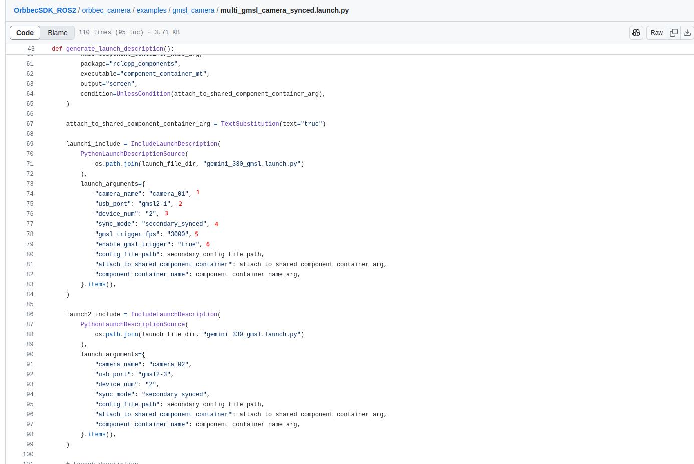

# Multi-device sync via GMSL2/FAKRA (ROS2)

## Introduction

GMSL multi-device synchronization, please refer [This document](https://www.orbbec.com/docs/gemini-335lg-hardware-synchronization/). There are two ways to use:

* The first is to put all the equipment `sync_mode` set `secondary_synced` mode, and synchronized by PWM trigger.
* The second is to put all the equipment `sync_mode` set `hardware_triggering` mode, and synchronized by PWM trigger.

About `sync_mode` please refer to GMSL for multi-device synchronization [Example launch](https://github.com/orbbec/OrbbecSDK_ROS2/blob/v2-main/orbbec_camera/examples/gmsl_camera/multi_gmsl_camera_synced.launch.py).

## Preparation before operation

The OrbbecSDK_ROS2 package is required to run GMSL multi-device synchronization. Please followInstallation Instructions Document and [Getting Started Document](https://github.com/orbbec/OrbbecSDK_ROS2/tree/v2-main?tab=readme-ov-file#getting-start) operate.

## Running GMSL multi-device synchronization

The OrbbecSDK_ROS2 package provides a [example](https://github.com/orbbec/OrbbecSDK_ROS2/tree/v2-main/orbbec_camera/examples/gmsl_camera), the example describes how to use GMSL single-device, GMSL multi-device, and GMSL multi-device synchronization.

### GMSL multi-device synchronization configuration

With two pieces of Gemini 335Lg device [Example launch](https://github.com/orbbec/OrbbecSDK_ROS2/blob/v2-main/orbbec_camera/examples/gmsl_camera/multi_gmsl_camera_synced.launch.py) example:

1. `camera_name`: The namespace of the startup node.
2. `usb_port`: The USB port number of the camera, which can be obtained in the following ways:

```bash
ros2 run orbbec_camera list_devices_node
```

3. `device_num`: number of devices
4. `sync_mode`: The synchronization mode of the device, optional value:`secondary_synced`and `hardware_triggering`(Note: sync\_mode needs to be set the same for both cameras).
5. `gmsl_trigger_fps`: Enter the synchronous FPS (frames per second) (for example: 3000, which means 30fps). Only the first device camera\_01 needs to be set. (If `sync_mode`set `hardware_triggering`, set to half the frame rate)
6. `enable_gmsl_trigger`: Enable GMSL synchronization. Only the first device camera\_01 needs to be turned on, the other cameras do not need to be turned on
7. `config_file_path`: The path to the YAML configuration file (using the camera configuration in the YAML file). The default is [camera\_secondary\_params.yaml](https://github.com/orbbec/OrbbecSDK_ROS2/blob/v2-main/orbbec_camera/config/camera_secondary_params.yaml)



### Running GMSL multi-device synchronization

After modifying the GMSL multi-device synchronization configuration, you can start the launch:

```bash
colcon build
source install/setup.bash
ros2 launch orbbec_camera multi_gmsl_camera_synced.launch.py
```

## GMSL multi-device synchronization effect verification

The OrbbecSDK\_ROS2 package provides a [example](https://github.com/orbbec/OrbbecSDK_ROS2/tree/v2-main/orbbec_camera/examples/multi_camera_synced_verification_tool), the example describes how to verify the effect of multi-device synchronization.

### Synchronize Tool Configuration

* **Modification**[**Multi\_save\_rgbir\_params.json.**](https://github.com/orbbec/OrbbecSDK_ROS2/blob/v2-main/orbbec_camera/config/tools/multisavergbir/multi_save_rgbir_params.json)

  * `time_domain`: Timestamp type (default global)
  * `usb_port`: The USB port number of the camera, and [Multi\_camera\_synced\_verify.launch.py](https://github.com/orbbec/OrbbecSDK_ROS2/blob/v2-main/orbbec_camera/examples/multi_camera_synced_verification_tool/multi_camera_synced_verify.launch.py) The device usb\_port order is consistent
  * `camera_name`: The namespace of the camera's startup node, and [Multi\_camera\_synced\_verify.launch.py](https://github.com/orbbec/OrbbecSDK_ROS2/blob/v2-main/orbbec_camera/examples/multi_camera_synced_verification_tool/multi_camera_synced_verify.launch.py) The device camera\_name of


* **Modification**[**Multi\_camera\_synced\_verify.launch.py**](https://github.com/orbbec/OrbbecSDK_ROS2/blob/v2-main/orbbec_camera/examples/multi_camera_synced_verification_tool/multi_camera_synced_verify.launch.py)

  * Please refer to [GMSL multi-device synchronization configuration](##gmsl-multi-device-synchronization-configuration)
* Run save_rgbir tool 4 seconds after all GMSL start nodes


### 4.2 verify GMSL multi-device synchronization

* **The first terminal:**

```bash
# Run GMSL multi-device sync and sync tools
source install/setup.bash
ros2 launch orbbec_camera multi_camera_synced_verify.launch.py
```

* **Second terminal:**

```bash
# Collect camera images and timestamp data, and generate a multicamera_sync directory in the current directory.
source install/setup.bash
ros2 service call /save_rgbir/start_capture orbbec_camera_msgs/srv/SetInt32 '{data: 100}'
```

After running the content of the second terminal, you need to modify it.[DevicesInfo.txt](https://github.com/orbbec/OrbbecSDK_ROS2/blob/v2-main/orbbec_camera/examples/multi_camera_synced_verification_tool/multicamera_sync/output/20250218102900/DevicesInfo.txt) and [Config.ini](https://github.com/orbbec/OrbbecSDK_ROS2/blob/v2-main/orbbec_camera/examples/multi_camera_synced_verification_tool/multicamera_sync/Python/Config.ini)

* Modification [**DevicesInfo.txt**](https://github.com/orbbec/OrbbecSDK_ROS2/blob/v2-main/orbbec_camera/examples/multi_camera_synced_verification_tool/multicamera_sync/output/20250218102900/DevicesInfo.txt)

  * `primarySerialNumber`: main device SN serial number (GMSL multi-device synchronous filling [Multi\_camera\_synced\_verify.launch.py](https://github.com/orbbec/OrbbecSDK_ROS2/blob/v2-main/orbbec_camera/examples/multi_camera_synced_verification_tool/multi_camera_synced_verify.launch.py) SN number of camera\_01 device)
  * `index`: Index of the device
  * `serialNumber`: SN serial number of the device


* Modification [**Config.ini**](https://github.com/orbbec/OrbbecSDK_ROS2/blob/v2-main/orbbec_camera/examples/multi_camera_synced_verification_tool/multicamera_sync/Python/Config.ini)

  * `frameRate`: Fill in the actual frame rate of the acquired data
  * `tspRangeThreshold`: Fill in the timestamp extreme difference card control of a group of data frames after matching (default is 4)


The modified [Python folder](https://github.com/orbbec/OrbbecSDK_ROS2/tree/v2-main/orbbec_camera/examples/multi_camera_synced_verification_tool/multicamera_sync/Python) Copy the modified multi\_camera\_synced subdirectory to the newly generated multi\_camera\_synced subdirectory [DevicesInfo.txt](https://github.com/orbbec/OrbbecSDK_ROS2/blob/v2-main/orbbec_camera/examples/multi_camera_synced_verification_tool/multicamera_sync/output/20250218102900/DevicesInfo.txt) and [StreamProfileInfo.txt](https://github.com/orbbec/OrbbecSDK_ROS2/blob/v2-main/orbbec_camera/examples/multi_camera_synced_verification_tool/multicamera_sync/output/20250218102900/StreamProfileInfo.txt) copy to the directory at the same level as the TotalModeFrames folder.

* **Third Terminal:**

```c++
# Select a group of data to be matched
cd multicamera_sync/Python
python3 ./SyncFramesMain.py
```


#### 4.2.1 View GMSL multi-device synchronization effect

The matched data is in the result folder, and the prefix of the file name is the same as the data of the same frame.

* **The folder definition in Results:**

  * **abnormal**: data exceeding the tspRangeThreshold setting (timestamp extreme difference card control) will be added with "xxxxxx" at the end of the file name ".
  * **matchFrames**: the matched data, including the data in the abnormal.
  * **notMatchFrames**: data not matched due to dropped frames.


## FAQ

**GMSL multi-device no video streaming**

* The usbfs\_memory\_mb value needs to be increased

```c++
Echo 128 | sys/module/usbcore/parameters/usbfs_memory_mb
```

**GMSL multi-device Image theme frame rate too low**

* GMSL multi-device Image theme frame rate is too low, please refer [This document](https://github.com/orbbec/OrbbecSDK_ROS2/blob/v2-main/docs/fastdds_tuning.md)
