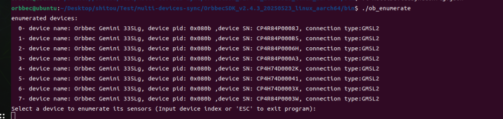
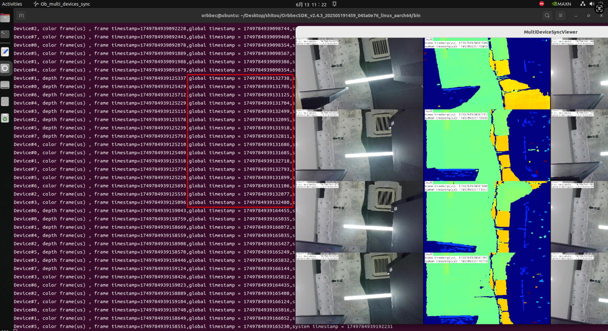

#  Multi-device sync via GMSL2/FAKRA(C++)

## 1. Introduction

 GMSL Multi devices Sync please refer this document,There are two usage methods:

The first is to set all devices as OB_MULTI_DEVICE_SYNC_MODE_SECONDARY mode and synchronize them through PWM triggering.

The second is to set all devices as OB_MULTI_DEVICE_SYNC_MODE_HARDWARE_TRIGGERING mode and synchronize them through PWM triggering.

PWM triggering source code please refer [ob_multi_devices_sync_gmsltrigger sample](./OrbbecSDK_v2.4.3_20250523_linux_aarch64/examples/src/3.advanced.multi_devices_sync_gmsltrigger).
Multi devices sync source code please refer [ob_multi_devices_sync sample](./OrbbecSDK_v2.4.3_20250523_linux_aarch64/examples/src/3.advanced.multi_devices_sync/)

- Notes: To make the multi devices sync sample simple and versatile, the PWM trigger has been separated into its own sample. GMSL2/FAKRA requires running two samples for testing. If you are developing your own application, you can combine these two functionalities into a single application.

## 2. How to test multi devices sync using C++ sample

### 2.1 Build
1. Open a terminal and run cd to enter the OrbbecSDK_v2.4.3_20250523_linux_aarch64 directory
2. Run the setup script to build and configure the environment: `sudo ./setup.sh`

###  2.2 Multi-devices sync configuration
Using eight Gemini 335Lg device as an example, If fewer than eight devices are connected, remove the extra devices from the JSON configuration file. Make sure the number of devices in the configuration file matches the actual number of connected devices, and please configure the correct serial numbers (SNs). the MultiDeviceSyncConfig.json is as follow:

~~~
{
    "version": "1.0.0",
    "configTime": "2023/01/01",
    "streamProfile": {
        "color": {
            "width": 1280,
            "height": 800,
            "format": "YUYV",
            "fps": 30
        },
        "depth": {
            "width": 1280,
            "height": 800,
            "format": "Y16",
            "fps": 30
        }
    },
    "sensorControl": {
        "enable": true,
        "depthPreset": "Default",
        "laserPowerLevel": 6,
        "laserOn": true,
        "disparitySearchRange": "256",
        "hardwareD2d": true,
        "hardwareNoiseRemoval": true,
        "softwareNoiseRemoval": false,
        "colorAutoExposure": true,
        "colorExposure": 50,
        "colorGain": 16,
        "irAutoExposure": false,
        "irExposure": 7500,
        "irGain": 16
    },
    "devices": [
        {
            "sn": "CP4R84P0008J",
            "syncConfig": {
                "syncMode": "OB_MULTI_DEVICE_SYNC_MODE_SECONDARY",
                "depthDelayUs": 0,
                "colorDelayUs": 0,
                "trigger2ImageDelayUs": 0,
                "triggerOutEnable": true,
                "triggerOutDelayUs": 0,
                "framesPerTrigger": 1
            }
        },
        {
            "sn": "CP4R84P000B5",
            "syncConfig": {
                "syncMode": "OB_MULTI_DEVICE_SYNC_MODE_SECONDARY",
                "depthDelayUs": 0,
                "colorDelayUs": 0,
                "trigger2ImageDelayUs": 0,
                "triggerOutEnable": true,
                "triggerOutDelayUs": 0,
                "framesPerTrigger": 1
            }
        },
        {
            "sn": "CP4R84P0006H",
            "syncConfig": {
                "syncMode": "OB_MULTI_DEVICE_SYNC_MODE_SECONDARY",
                "depthDelayUs": 0,
                "colorDelayUs": 0,
                "trigger2ImageDelayUs": 0,
                "triggerOutEnable": true,
                "triggerOutDelayUs": 0,
                "framesPerTrigger": 1
            }
        },
        {
            "sn": "CP4R84P000A3",
            "syncConfig": {
                "syncMode": "OB_MULTI_DEVICE_SYNC_MODE_SECONDARY",
                "depthDelayUs": 0,
                "colorDelayUs": 0,
                "trigger2ImageDelayUs": 0,
                "triggerOutEnable": true,
                "triggerOutDelayUs": 0,
                "framesPerTrigger": 1
            }
        },
        {
            "sn": "CP4H74D0002K",
            "syncConfig": {
                "syncMode": "OB_MULTI_DEVICE_SYNC_MODE_SECONDARY",
                "depthDelayUs": 0,
                "colorDelayUs": 0,
                "trigger2ImageDelayUs": 0,
                "triggerOutEnable": true,
                "triggerOutDelayUs": 0,
                "framesPerTrigger": 1
            }
        },
        {
            "sn": "CP4H74D00041",
            "syncConfig": {
                "syncMode": "OB_MULTI_DEVICE_SYNC_MODE_SECONDARY",
                "depthDelayUs": 0,
                "colorDelayUs": 0,
                "trigger2ImageDelayUs": 0,
                "triggerOutEnable": true,
                "triggerOutDelayUs": 0,
                "framesPerTrigger": 1
            }
        },
        {
            "sn": "CP4H74D0003X",
            "syncConfig": {
                "syncMode": "OB_MULTI_DEVICE_SYNC_MODE_SECONDARY",
                "depthDelayUs": 0,
                "colorDelayUs": 0,
                "trigger2ImageDelayUs": 0,
                "triggerOutEnable": true,
                "triggerOutDelayUs": 0,
                "framesPerTrigger": 1
            }
        },
        {
            "sn": "CP4R84P0003W",
            "syncConfig": {
                "syncMode": "OB_MULTI_DEVICE_SYNC_MODE_SECONDARY",
                "depthDelayUs": 0,
                "colorDelayUs": 0,
                "trigger2ImageDelayUs": 0,
                "triggerOutEnable": true,
                "triggerOutDelayUs": 0,
                "framesPerTrigger": 1
            }
        }
    ]
}

~~~


- sn: Replace with the actual serial number of the device,you can use device enumerate sample to obtain SN.


- syncMode: Can be set to either OB_MULTI_DEVICE_SYNC_MODE_SECONDARY or OB_MULTI_DEVICE_SYNC_MODE_HARDWARE_TRIGGERING.

The differences between the two sync modes are as follows:

 - OB_MULTI_DEVICE_SYNC_MODE_SECONDARY: Sets the device to secondary mode. In this mode, the PWM trigger frame rate must match the actual streaming frame rate. For example, if the streaming frame rate is 30 fps, the PWM frame rate must also be set to 30

 - OB_MULTI_DEVICE_SYNC_MODE_HARDWARE_TRIGGERING: Sets the device to hardware triggering mode. In this mode, the PWM trigger signal must not exceed half of the streaming frame rate. For example, if the streaming frame rate is set to 30 fps, and the PWM trigger signal exceeds 15, the camera will still only capture images at 15 fps. In other words, when the streaming frame rate is 30 fps, the valid range for the PWM trigger signal is 1 to 15 fps.


~~~
   "sensorControl": {
        "enable": true,
        "depthPreset": "Default",
        "laserPowerLevel": 6,
        "laserOn": true,
        "disparitySearchRange": "256",
        "hardwareD2d": true,
        "hardwareNoiseRemoval": true,
        "softwareNoiseRemoval": false,
        "colorAutoExposure": true,
        "colorExposure": 50,
        "colorGain": 16,
        "irAutoExposure": false,
        "irExposure": 7500,
        "irGain": 16
    }
~~~

- enable =true: indicates the following parameters will be set; false: the following parameters will not be set.
- hardwareD2d:  true: use hardware d2d ; false: use software d2d.
- hardwareNoiseRemoval: true: enable hardware noise removal filter; false: disable hardware noise removal filter.
- softwareNoiseRemoval: true: enable software noise removal filter; false: disable software noise removal filter.

**1. Open the first terminal and run the multi-devices sync sample**
~~~
```cpp
$ ./ob_multi_devices_sync

--------------------------------------------------
Please select options: 
 0 --> config devices sync mode. 
 1 --> start stream 
--------------------------------------------------
Please select input: 0

~~~

**2. Open the second terminal and run the sample that sends PWM trigger signals with administrator privileges**

~~~
orbbec@agx:~/SensorSDK/build/install/Example/bin$ sudo ./ob_multi_devices_sync_gmsltrigger
Please select options: 
------------------------------------------------------------
 0 --> config GMSL SOC hardware trigger Source. Set trigger fps: 
 1 --> start Trigger 
 2 --> stop Trigger 
 3 --> exit 
------------------------------------------------------------
input select item: 0

Enter FPS (frames per second) (for example: 3000): 3000
Setting FPS to 3000...
Please select options: 
------------------------------------------------------------
 0 --> config GMSL SOC hardware trigger Source. Set trigger fps: 
 1 --> start Trigger 
 2 --> stop Trigger 
 3 --> exit 
------------------------------------------------------------
input select item: 1

~~~

Notes:
Enter FPS (frames per second) (for example: 3000): 3000(3000 indicates 30 fps) . 

### 2.3 Test Results
Observe the timestamps. As shown in the figure below, the device timestamps of the two devices are identical, indicating that the two devices are successfully synchronized.

