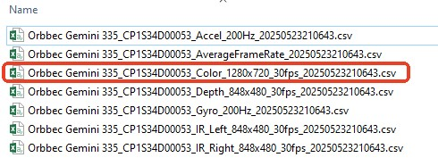
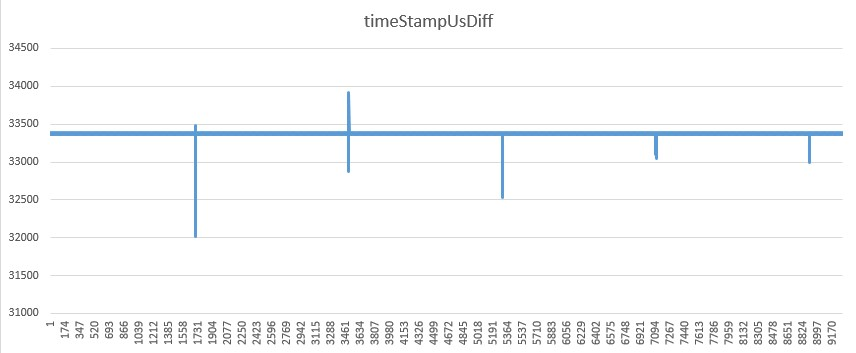
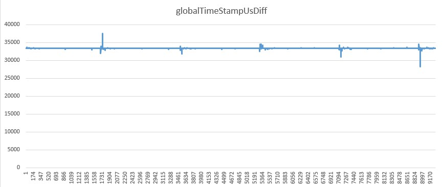

# Camera Timestamp Tracker Tool

## Overview

Frame rate and timestamp stability are two important performance indicators for cameras.  
We need a tool that can record frame rate and timestamps in order to analyze their stability.

## Features

The tool mainly supports the following features:
1. Load the first connected camera device on the system and start all supported data streams;
2. Capture each frame from the data streams and save frame rate, timestamp, and other information into a CSV file. The CSV files are saved in the `output` directory under the tool’s folder. The filename format is:  
   `{DeviceName}_{DeviceSN}_{Sensor}_{Resolution}_{FrameRate}fps_{Timestamp}.csv`  
   For example:  
   `Orbbec Gemini 335Lg_CP1S34D0002D_Color_848x480_30fps_20250517164457.csv`.  
   Data saved to the CSV file is as follows:  
   1. Number: frame index
   2. systemTimeStampUs: the system timestamp (in microseconds) when the frame was received
   3. globalTimeStampUs: global timestamp (in microseconds) derived from the device timestamp through linear fitting.
   4. timeStampUs: device timestamp (in microseconds)
   5. indexDiff: the difference between the current frame index and the previous frame index
   6. globalTimeStampUsDiff: the difference between the current global timestamp and the previous global timestamp
   7. timeStampUsDiff: the difference between the current device timestamp and the previous device timestamp
3. Calculate the current frame rate every second and save it to a CSV file. The CSV file is saved in the `output` directory under the tool’s folder. The filename format is:  
   `{DeviceName}_{DeviceSN}_AverageFrameRate_{Timestamp}.csv`  
   For example:  
   `Orbbec Gemini 335Lg_CP1S34D0002D_AverageFrameRate_20250517164457.csv`
4. Supported devices: Various cameras supported by the OpenOrbbecSDK.

## Usage

### Build and Launch

1. Extract the OrbbecSDK sample package OrbbecSDK_v2.4.3_20250523_linux_aarch64.zip to the current directory
2. Open a terminal and run cd to enter the extracted directory
3. Run the setup script to build and configure the environment: `sudo ./setup.sh`
4. cd into the bin directory: `cd ./bin`
5. Start: `sudo ./ob_timestamp_tracker`  
   By default, the tool will keep running unless the user exits manually.  
   Alternatively, run the tool in a terminal and specify the runtime duration (in minutes):  
   `sudo ./ob_timestamp_tracker -t 10`

### Exit

1. The program exits automatically after capturing the specified number of frames;
2. Or press the `Esc` key in the window, or close the window directly to exit the program.

## Data Analysis

### Timestamp

1. First, locate the CSV file corresponding to the data stream, such as the Color stream, and open it with Excel.

2. Then, select the data column you want to visualize
3. Go to the Insert tab on the ribbon at the top
4. In the Charts group, click on the Insert Line or Area Chart icon
5. Choose the Line chart style you prefer (e.g., “Line,” “Line with Markers”).  
   The chart will be inserted into your worksheet

#### Deivce timestamp difference

#### Global timestamp difference

